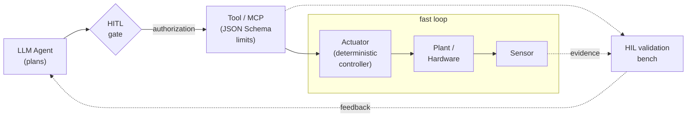
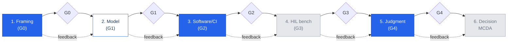
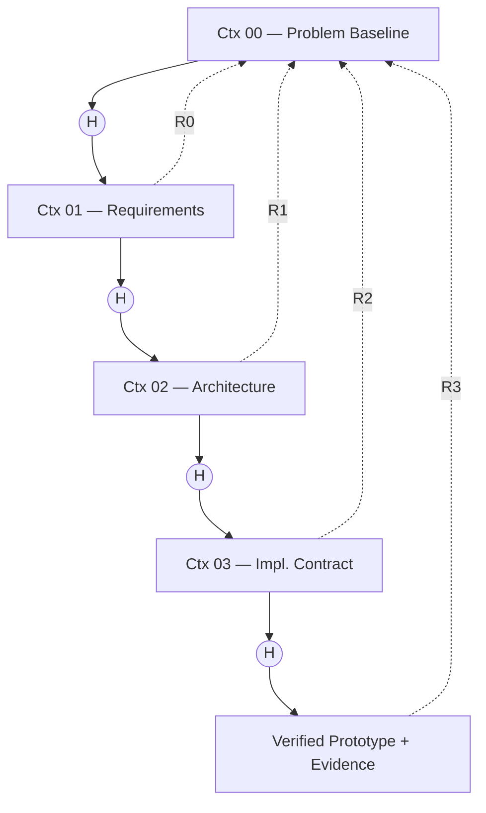
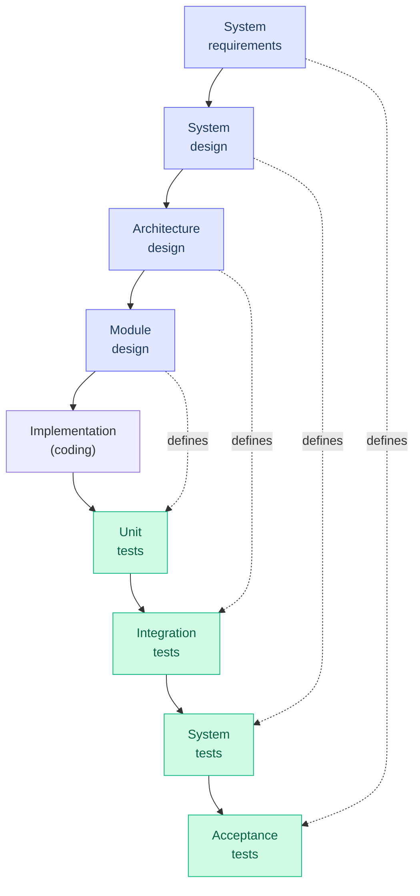
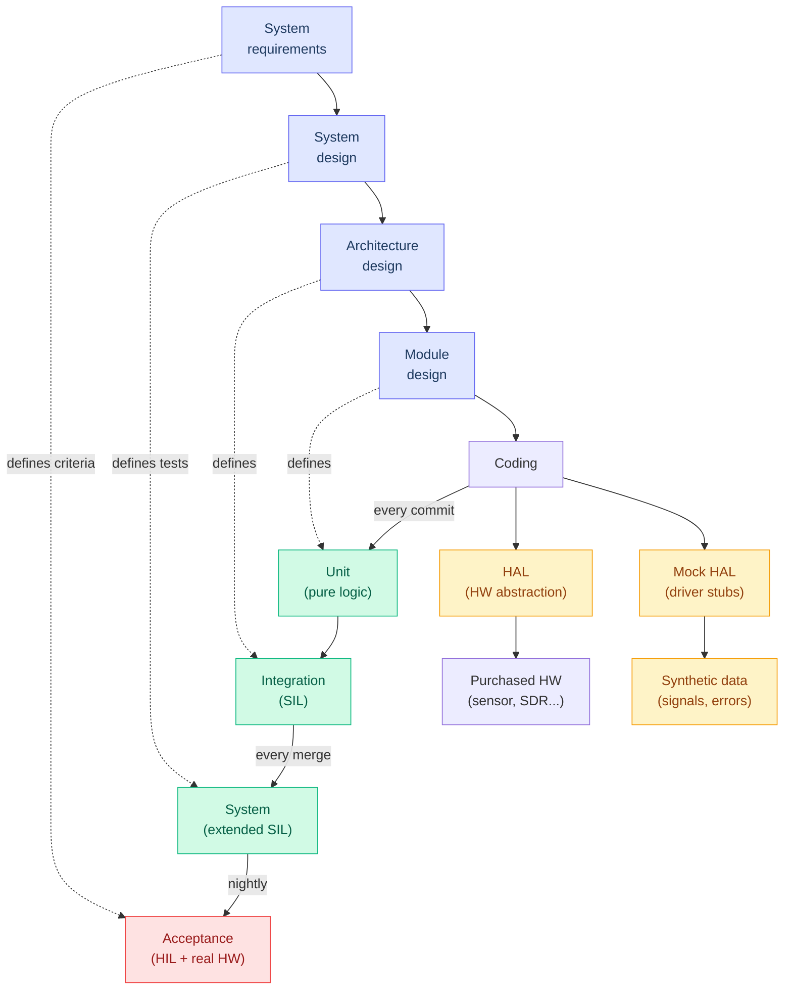
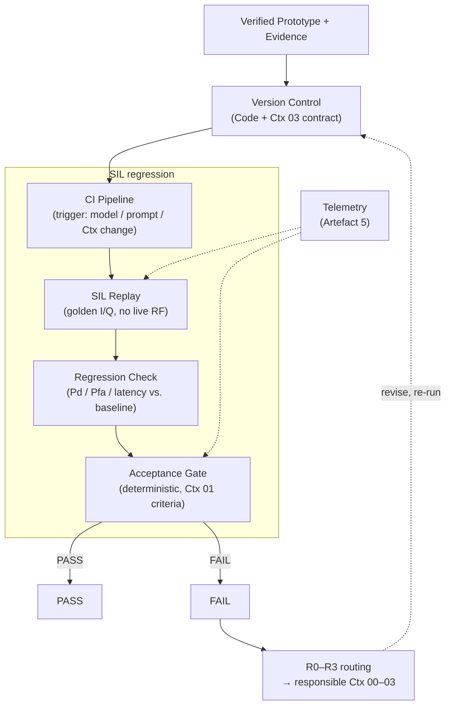

# **CI+SIL** × **zz\_Workflow**

Rationale for Coupling Continuous Integration with the LLM-Assisted Prototype Engine

#### **David Ramírez-Betancourt**

Universidad Nacional de Colombia — GCPDS

October 2026

**Scope.** This note justifies, from the literature and from the project's own context documents, why Continuous Integration with Software-in-the-Loop (CI+SIL) is the first integration tier for the zz\_Workflow engine in the SDR FM sensor project.

### **1 Introduction**

The SDR FM sensor project uses an LLM-assisted workflow, zz\_Workflow, to produce verified prototypes. The workflow constrains a language model inside four context-bounded stages with human-gated transitions, and it ends in a prototype accompanied by recorded evidence.

What the project still lacks is a robust strategy for *continuous* verification: once a prototype exists, every later change to code, prompt, model, or context document can silently invalidate the evidence that justified it. LLM-assisted systems make this risk sharper, because the generator is probabilistic and its behaviour can shift without any change to the source tree [17, 3].

This note compares the main validation methodologies against what zz\_Workflow already produces, and argues for one coupling. **Thesis:** CI+SIL is the natural HIGH and clean coupling. The regression suites that zz\_Workflow already requires are, in effect, a CI harness, and replaying controlled I/Q in software needs no live RF. The coupling preserves the engine's central rule that the model never approves its own work. It also keeps claims honest: it delivers *verification*, and it leaves live *validation* to downstream tiers.

Sections 2 to 4 give the foundation and the methodological landscape. Sections 5 and 6 cover AI-assisted hypothesis validation and the engine itself. Sections 7 to 9 analyse the coupling, contrast it with the V-model in detail, and then refine it; Section 10 concludes.

# **2 Foundation: Current AI Agents**

**Probabilistic, not deterministic.** LLM outputs vary even at nominal zero temperature; the *background temperature* induced by the inference stack makes identical prompts yield different results [17]. Any workflow that assumes repeatability must therefore measure it rather than assume it.

**A degradation ceiling.** Agent reliability decays roughly geometrically with the number of sequential steps, with a practical ceiling near 16 steps [3]. If each step succeeds with probability *p*, a chain of *n* steps succeeds with *pⁿ*; the projected success at about 100 steps is only ≈ 0.24. Long autonomous chains are structurally fragile, which argues for short, bounded stages.

**Incentives favour hallucination.** Benchmarks that score accuracy alone reward confident guessing over abstention, so models are trained to hallucinate [2]. Self-reported correctness is therefore weak evidence.

**Structure beats instructions.** Reliability gains come mainly from workflow structure (typed interfaces, gates, retries, explicit state) rather than from longer instructions [5]. Likewise, **context engineering outranks prompt engineering**: what the model sees at each step, and nothing more, is the controllable variable [4].

**Orchestration under constraints.** Surveyed agent systems orchestrate multiple tools while managing state, cost, and safety constraints [1]. These are the same constraints a verified-prototype pipeline must make explicit.

# **3 Hardware Control via Tools**

An LLM only produces text. It reaches hardware through *tools*, using function calling and the Model Context Protocol (MCP) [6, 1]. The resulting closed loop is: agent → tool/MCP → actuator → sensor → feedback to the agent.

**Two-level control.** The LLM plans at the slow level; a deterministic controller executes the fast loop. The model never sits inside a real-time loop. **Physical limits** declared in the tool's JSON Schema (ranges, units, enumerations) are the first line of defence, since a call that violates the schema is rejected before it reaches the device. Schema clarity also correlates with tool-call accuracy [1].

Two human barriers complement this. *Human-in-the-loop* (HITL) is an **authorization** barrier: a person approves consequential actions. *Hardware-in-the-loop* (HIL) is a **validation** barrier: the control software is exercised against real or emulated hardware [7].

> **Figure 1:** Two-level agent–hardware control loop. The LLM plans; schema-bounded tools and a deterministic controller act; HITL authorizes, HIL validates.

# **4 Validation Methodologies Compared**

Five approaches are in common use: the **V-model** [10, 16], **CI+SIL with TDD**, **HIL benches** [7, 11], **LLM-as-judge with HITL** [14, 13], and **multi-criteria decision analysis (MCDA)** [15].

They share four principles: (i) verification is not validation; (ii) checks run from cheap to expensive; (iii) an *external oracle* decides; and (iv) humans act at the extremes (framing and final decision). In short, *nobody validates in one step; you validate in layers*.

The need is empirical. Roughly 83 % of autonomous-research agents publish code, but only 38 % provide reproducible artifacts [8]. And the key structural rule is that the **oracle must not be the generator** [9].

> **Figure 2:** Six-phase validation flow with gates G0–G4 and feedback paths. Phases 1, 3, 5 are covered by zz\_Workflow (solid blue); phase 2 is partial (outline); phases 4 and 6 are gaps (grey).

# **5 Validating Hypotheses with AI**

**Code is AI's strongest contribution.** The generate → execute → test → repair loop turns model output into something an external executor can accept or reject. Heinrichs et al. report hundreds of simulate–evaluate–modify iterations with an LLM scripting CST, ADS, and KiCad [12].

**LLM-as-judge needs calibration.** Agreement with human raters should reach Cohen's *κ* ≥ 0.6 (and ≥ 0.8 for strong agreement), with explicit controls for position, verbosity, and self-preference bias [14, 9].

**Simulation has a ceiling.** HIL enters when the restriction is hardware [7]. HITL retains irreducible value: in the reported work, humans detected geometry idealizations and routing inconsistencies that automated evaluation missed [13, 12].

"Validated in simulation" does not mean "validated." The claim must name the environment in which the evidence was produced.

# **6 The zz\_Workflow Engine**

zz\_Workflow has four context-bounded stages: **Ctx 00** (Problem Baseline), **Ctx 01** (Requirements), **Ctx 02** (Architecture), and **Ctx 03** (Implementation Contract). Transitions are human-gated: the model drafts but never approves. The governing rule is:

*Acceptance is decided by pre-declared criteria applied to recorded measurements, never by model judgement.*

The terminal output is a **Verified Prototype + Evidence**, which is explicitly *verification*, not validation. When a check fails, **R0–R3 defect routing** returns the classified failure to the responsible stage.

Six governing artifacts support the engine. The most relevant here is **Artefact 3**: the evaluation and benchmarking suites, which act as regression checks after *any* model, prompt, or context change.

> **Figure 3:** zz\_Workflow stages with human gates (H), R0–R3 defect routing back to the responsible stage, the six governing artifacts, and the terminal output.

#### **Governing artifacts**

1. Problem baseline
2. Requirements
3. **Eval / benchmark suites**
4. Contract
5. Telemetry
6. Evidence log

Table 1 rates each methodology by how directly it couples to what zz\_Workflow already produces.

**Table 1:** Coupling of each validation methodology with zz\_Workflow.

| Approach | Coupling | Reason |
|---|---|---|
| CI+SIL | HIGH / clean | Artefact 3 is already a regression harness; SIL replays I/Q without RF. |
| V&V (V-model) | HIGH–MEDIUM | Matches the stage structure but adds heavy traceability overhead. |
| LLM-judge + HITL | MEDIUM | Useful for review, but conflicts with deterministic acceptance. |
| HIL bench | MEDIUM–LOW | Needs physical infrastructure not yet in the loop. |
| MCDA | LOW | Applies to multi-hypothesis choice, not to single-prototype verification. |

**Artefact 3 already is the harness.** Coupling CI to it requires no new concept: the suites run automatically instead of manually.

**The name is precise.** "Verified" ≠ "validated": the output claims conformance to pre-declared criteria, not fitness in the field.

**Omitting LLM-as-judge for acceptance is a strength.** When the same component proposes and evaluates, optimization pressure exploits evaluator weaknesses [9]. The recipe is role separation plus deterministic gates, where *mechanical rejection beats LLM approval, never the reverse*.

Against the six phases of Figure 2: phases 1, 3, 5 are **covered**; phase 2 is **partial**; phases 4 and 6 are **gaps**.

# **8 V-model vs. CI+SIL**

The coupling table rates the V-model as a HIGH–MEDIUM alternative to CI+SIL. The two are often read as rival paradigms, but they are not: **CI+SIL is the V-model's right arm made continuous**. Understanding the relationship clarifies why CI+SIL is the cleaner choice for zz\_Workflow while the V-model's structure is largely preserved.

#### **8.1 The classic V-model**

The V-model pairs a descending *design/verification* arm with an ascending *testing/validation* arm [10, 16]. Each left-hand level (system requirements, system design, architecture design, module design) *defines the tests* for the right-hand level that mirrors it: requirements ↔ acceptance, system design ↔ system test, architecture ↔ integration, module design ↔ unit test. The valley is implementation. The dashed horizontals are these "defines-its-tests" links. The model is strong on traceability and on separating verification from validation, but in its classic form the entire right arm is a *single, late* pass: tests run once, after the full descent and ascent, and the oracle arrives at the end.

> **Figure 4:** The classic software V-model. A descending design/verification arm (purple) mirrors an ascending testing/validation arm (green); each left level *defines the tests* for the level facing it (dashed). Implementation sits at the valley, and the whole right arm runs as a single late pass.

## **8.2 Re-reading the right arm as CI+SIL**

CI+SIL keeps the same four test levels but changes *when* and *against what* they run. Instead of one late pass, the levels execute automatically and continuously against a software-modelled plant — the SIL rung of the MIL→SIL→PIL→HIL ladder [7, 11]:

- **Unit** (pure logic) runs *on every commit*; **integration** (SIL) *on every merge*; **system** (extended SIL) *nightly*.

> **Figure 5:** The V-model re-read as CI+SIL. The descending design arm (purple) is unchanged; the ascending test arm (green) keeps the same four levels but runs continuously as SIL, triggered on commit, merge, and nightly, against a Mock HAL fed by synthetic I/Q (amber). Only acceptance stays at real hardware (red, HIL). The dashed horizontals are the V-model's "defines-its-tests" links.

- **Acceptance** stays at the apex as **HIL + real hardware** — the one level that CI+SIL does *not* absorb, and the shared downstream gap.
- To run the lower arm without RF, CI+SIL adds a thin substitution layer (amber): a **HAL** that abstracts the device behind an interface, a **Mock HAL** of driver stubs, and **synthetic data** (golden I/Q, injected error cases) that feed the mock. Purchased hardware sits behind the *same* HAL, so the swap from mock to real device is transparent to the code under test.

### **8.3 Where they differ, and why CI+SIL wins here**

**Table 3:** V-model versus CI+SIL on the dimensions relevant to zz\_Workflow.

| Dimension | V-model | CI+SIL |
|---|---|---|
| Test cadence | One late pass after full descent | Continuous: commit / merge / nightly |
| Oracle timing | Arrives at the end | Fires on every change, early |
| Hardware need | Right arm tends to assume the device | Lower arm runs on Mock HAL + synthetic I/Q; no RF |
| Traceability | Explicit and heavy; its main cost | Lighter; encoded in the suite and version control |
| Regression | Not intrinsic; re-runs are manual | Intrinsic: every trigger re-runs the full suite |
| Fit to zz\_Workflow | Matches the gated, traceable stages, but adds ceremony | Matches Artefact 3 (already a regression harness) and the trigger-on-any-change reality |

The V-model and CI+SIL agree on the two structural rules zz\_Workflow depends on: an *oracle distinct from the generator* and a clean *verification* vs. *validation* split, with live validation (HIL + field) left to the apex. They differ on cadence and cost. The V-model's structure already resembles zz\_Workflow — gated stages, each defining its own acceptance — which is why it scores HIGH–MEDIUM; but its single late test pass and heavy traceability apparatus are a poor match for a probabilistic generator whose behaviour can drift on *any* model, prompt, or context change. CI+SIL preserves the V-model's level structure while making the right arm continuous and triggering on exactly those changes. It also demands no new concept from the engine: Artefact 3 is already the harness.

- **Acceptance gate:** deterministic, using the criteria from Ctx 01.
- **Telemetry** (Artefact 5) records failure classes and points to the Ctx to revise. The R0–R3 routing is reused: CI states *which* stage receives the defect.

Live-RF HIL remains a downstream gap.

> **Figure 6:** CI+SIL coupled with zz\_Workflow. A model, prompt, or context change triggers SIL replay and regression checks against the evidence baseline; a deterministic gate decides, and failures are routed by R0–R3 to the responsible stage while telemetry records the failure class.

# **10 Conclusion**

CI+SIL is the natural first integration tier for zz\_Workflow. The coupling is HIGH and clean because Artefact 3 already is the regression harness: the evidence produced at the end of the workflow seeds the baseline, and the Ctx 03 contract together with the code serves as an executable specification under version control.

Deterministic gates preserve the principle that the model never approves its own work. Triggering on model, prompt, or context changes, and not only on code commits, fits the real failure modes of LLM-assisted systems. Reusing the R0–R3 routing lets CI say which stage must revise the defect.

Two gaps remain downstream: an HIL bench for live RF validation, and MCDA for selecting among multiple hypotheses. Keeping the distinction between *verified* and *validated* makes the claims honest and the next steps tractable.
