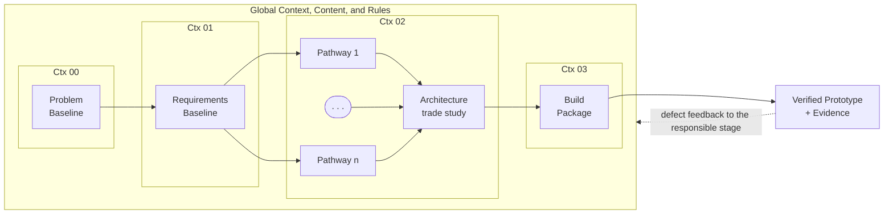
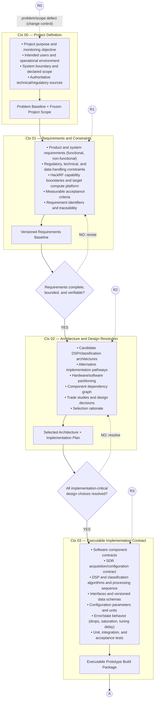
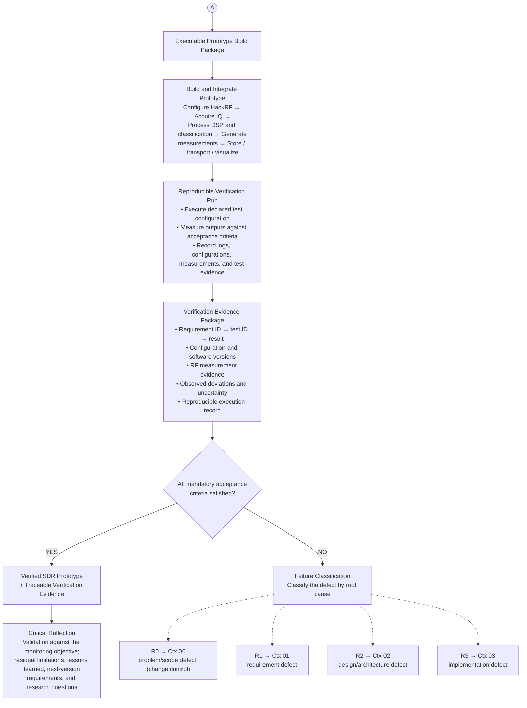

# Prototype-development Engine

The prototype-development engine is an LLM-assisted workflow for building the SDR-based FM spectrum-sensing sensor. Development proceeds through four stages, Ctx 00–Ctx 03. Each stage is bounded by a context package (Ctx N)—the content and rules the model works from at that stage—and ends in a named output. Two of the four stage transitions (Ctx 01→02 and Ctx 02→03) are protected by an explicit readiness gate in Figure 2; the Ctx 00 output freezes the project scope, and the Ctx 03 output is checked against acceptance criteria in the build and verification phase (Figure 3). At every transition, whether or not a gate diamond is drawn, the human reviewer decides whether to proceed; the model drafts within a stage but never approves its own output. Acceptance is decided by pre-declared criteria applied to recorded measurements, never by model judgement.

Figure 1 gives the overview, Figure 2 the definition phase (Ctx 00–03) with its readiness gates, and Figure 3 the build, verification, and failure-routing phase, closing with a critical-reflection step on the verified prototype. Solid blue arrows show the nominal flow; dashed grey arrows show feedback after a failed gate or a classified defect; diamonds are gates; the red box marks the terminal output. Connector A carries the build package from Figure 2 to Figure 3, and connectors R0–R3 return a classified defect to the stage responsible for it. Once frozen, the project scope is reopened only through R0, as a controlled change.

---

## Figure 1 — Overview of the LLM-assisted prototype-development engine

**Nodes / flow shown in the figure.** Four context-bounded stages (Ctx 00–03), spanning a shared *Global Context, Content, and Rules* band, lead from the problem baseline to the verified prototype:

- **Ctx 00** → Problem Baseline
- **Ctx 01** → Requirements Baseline
- **Ctx 02** → Architecture trade study (candidate Pathway 1 … Pathway n)
- **Ctx 03** → Build Package
- Terminal output → **Verified Prototype + Evidence**
- Feedback → *defect feedback to the responsible stage*

### Plain-text diagram

```text
+===============================================================================+
|                      GLOBAL CONTEXT, CONTENT, AND RULES                        |
|                                                                               |
|    Ctx 00          Ctx 01              Ctx 02               Ctx 03            |
|  +---------+     +--------------+    +-----------------+   +-----------+       |
|  | Problem | --> | Requirements | -> | Pathway 1       |   |  Build    |      |
|  | Baseline|     | Baseline     |    |    .            |   |  Package  |      |
|  +---------+     +--------------+    |    .            |   +-----------+      |
|                                     |    .            |        |             |
|                                     | Pathway n       |        |             |
|                                     |       \         |        |             |
|                                     |        v        |        |             |
|                                     | Architecture    | ------>+             |
|                                     | trade study     |                      |
|                                     +-----------------+                      |
+===============================================================================+
                                            |
                                            v
                             +--------------------------------+
                             | Verified Prototype + Evidence  |   <== terminal
                             +--------------------------------+
                                            |
      <----- defect feedback to the responsible stage (returns upstream) -------+
```

### Mermaid diagram



*Figure 1: Overview of the LLM-assisted prototype-development engine: four context-bounded stages (Ctx 00–03) lead from the problem baseline to a verified prototype; defects are fed back to the stage responsible. Node names are abbreviated here for legibility; see Figures 2–3 for the full output names.*

> **Note:** *Problem Baseline* means the agreed, stable definition of the problem the project is intended to solve before detailed requirements or architecture are developed. It corresponds mainly to the output of Ctx 00 — Project Definition, which establishes the project purpose and monitoring objective, intended users and operational environment, system boundary, declared scope, and authoritative technical/regulatory sources.

---

## Figure 2 — Definition phase of the engine (Ctx 00–03)

### Stage contents, outputs, and gates (as shown in the figure)

**Ctx 00 — Project Definition**
- Project purpose and monitoring objective
- Intended users and operational environment
- System boundary and declared scope
- Authoritative technical/regulatory sources

→ **Output:** Problem Baseline + Frozen Project Scope

**Ctx 01 — Requirements and Constraints**
- Product and system requirements (functional, non-functional)
- Regulatory, technical, and data-handling constraints
- HackRF capability boundaries and target compute platform
- Measurable acceptance criteria
- Requirement identifiers and traceability

→ **Output:** Versioned Requirements Baseline
→ **Gate:** *Requirements complete, bounded, and verifiable?* — **YES** → Ctx 02; **NO: revise** → back to Ctx 01

**Ctx 02 — Architecture and Design Resolution**
- Candidate DSP/classification architectures
- Alternative implementation pathways
- Hardware/software partitioning
- Component dependency graph
- Trade studies and design decisions
- Selection rationale

→ **Output:** Selected Architecture + Implementation Plan
→ **Gate:** *All implementation-critical design choices resolved?* — **YES** → Ctx 03; **NO: resolve** → back to Ctx 02

**Ctx 03 — Executable Implementation Contract**
- Software component contracts
- SDR acquisition/configuration contract
- DSP and classification algorithms and processing sequence
- Interfaces and versioned data schemas
- Configuration parameters and units
- Error/state behavior (drops, saturation, tuning delay)
- Unit, integration, and acceptance tests

→ **Output:** Executable Prototype Build Package → connector **A**

**Return connectors (receive classified defects from Figure 3):** R0 → Ctx 00 (problem/scope defect, change control), R1 → Ctx 01, R2 → Ctx 02, R3 → Ctx 03.

### Plain-text diagram

```text
 R0 (from Fig. 3) .............................................................,
                                                                              v
   +==========================================================================+
   |  Ctx 00 - Project Definition                                             |
   |    * Project purpose and monitoring objective                           |
   |    * Intended users and operational environment                         |
   |    * System boundary and declared scope                                 |
   |    * Authoritative technical/regulatory sources                         |
   +==========================================================================+
                                   |
                                   v
                 [[ Problem Baseline + Frozen Project Scope ]]
                                   |
 R1 (from Fig. 3) ....,            v
                      v   +==========================================================================+
                      '-->|  Ctx 01 - Requirements and Constraints                                 |
                          |    * Product and system requirements (functional, non-functional)     |
   ,--- NO: revise -------|    * Regulatory, technical, and data-handling constraints              |
   |                      |    * HackRF capability boundaries and target compute platform          |
   |                      |    * Measurable acceptance criteria                                    |
   |                      |    * Requirement identifiers and traceability                          |
   |                      +==========================================================================+
   |                                       |
   |                                       v
   |                      [[ Versioned Requirements Baseline ]]
   |                                       |
   |                                       v
   |                      < Requirements complete,       >
   '--------------------<   bounded, and verifiable?      >
                          <_______________________________>
                                       | YES
                                       v
 R2 (from Fig. 3) ....,
                      v   +==========================================================================+
                      '-->|  Ctx 02 - Architecture and Design Resolution                           |
                          |    * Candidate DSP/classification architectures                        |
   ,--- NO: resolve ------|    * Alternative implementation pathways                               |
   |                      |    * Hardware/software partitioning                                    |
   |                      |    * Component dependency graph                                        |
   |                      |    * Trade studies and design decisions                                |
   |                      |    * Selection rationale                                               |
   |                      +==========================================================================+
   |                                       |
   |                                       v
   |                      [[ Selected Architecture + Implementation Plan ]]
   |                                       |
   |                                       v
   |                      < All implementation-critical  >
   '--------------------<   design choices resolved?      >
                          <_______________________________>
                                       | YES
                                       v
 R3 (from Fig. 3) ....,
                      v   +==========================================================================+
                      '-->|  Ctx 03 - Executable Implementation Contract                           |
                          |    * Software component contracts                                      |
                          |    * SDR acquisition/configuration contract                            |
                          |    * DSP and classification algorithms and processing sequence         |
                          |    * Interfaces and versioned data schemas                             |
                          |    * Configuration parameters and units                                |
                          |    * Error/state behavior (drops, saturation, tuning delay)            |
                          |    * Unit, integration, and acceptance tests                           |
                          +==========================================================================+
                                       |
                                       v
                      [[ Executable Prototype Build Package ]]
                                       |
                                       v
                                     ( A )  --> continues in Figure 3
```

### Mermaid diagram



*Figure 2: Definition phase of the engine (Ctx 00–03): context packages, stage outputs, and readiness gates. Connector A continues in Figure 3; R0–R3 receive classified defects from it.*

---

## Figure 3 — Build, verification, and failure-routing phase

### Stage contents, gate, and routing (as shown in the figure)

Connector **A** (from Figure 2) → **Executable Prototype Build Package**

**Build and Integrate Prototype**
Configure HackRF → Acquire IQ → Process DSP and classification → Generate measurements → Store / transport / visualize

**Reproducible Verification Run**
- Execute declared test configuration
- Measure outputs against acceptance criteria
- Record logs, configurations, measurements, and test evidence

**Verification Evidence Package**
- Requirement ID → test ID → result
- Configuration and software versions
- RF measurement evidence
- Observed deviations and uncertainty
- Reproducible execution record

**Gate:** *All mandatory acceptance criteria satisfied?*
- **YES** → **Verified SDR Prototype + Traceable Verification Evidence** → **Critical Reflection** (Validation against the monitoring objective; residual limitations, lessons learned, next-version requirements, and research questions)
- **NO** → **Failure Classification** (Classify the defect by root cause):
  - **R0 → Ctx 00** — problem/scope defect (change control)
  - **R1 → Ctx 01** — requirement defect
  - **R2 → Ctx 02** — design/architecture defect
  - **R3 → Ctx 03** — implementation defect

### Plain-text diagram

```text
                                   ( A )  (from Figure 2)
                                     |
                                     v
                     [[ Executable Prototype Build Package ]]
                                     |
                                     v
   +==============================================================+
   |  Build and Integrate Prototype                               |
   |    Configure HackRF -> Acquire IQ ->                         |
   |    Process DSP and classification -> Generate                |
   |    measurements -> Store / transport / visualize             |
   +==============================================================+
                                     |
                                     v
   +==============================================================+
   |  Reproducible Verification Run                               |
   |    * Execute declared test configuration                     |
   |    * Measure outputs against acceptance criteria             |
   |    * Record logs, configurations, measurements, test evidence|
   +==============================================================+
                                     |
                                     v
   +==============================================================+
   |  Verification Evidence Package                               |
   |    * Requirement ID -> test ID -> result                     |
   |    * Configuration and software versions                     |
   |    * RF measurement evidence                                 |
   |    * Observed deviations and uncertainty                     |
   |    * Reproducible execution record                           |
   +==============================================================+
                                     |
                                     v
                      < All mandatory acceptance  >
                      <  criteria satisfied?       >
                      <___________________________>
                        |                       |
                     YES|                       |NO
                        v                       v
   +===========================+   +==================================+
   | Verified SDR Prototype    |   | Failure Classification           |
   | + Traceable Verification  |   | Classify the defect by root cause|
   | Evidence                  |   +==================================+
   +===========================+              |
             |                                +--> R0 -> Ctx 00 : problem/scope defect (change control)
             v                                +--> R1 -> Ctx 01 : requirement defect
   +===========================+              +--> R2 -> Ctx 02 : design/architecture defect
   | Critical Reflection       |              +--> R3 -> Ctx 03 : implementation defect
   | Validation against the    |
   | monitoring objective;     |        (R0-R3 re-enter Figure 2 at the stage
   | residual limitations,     |         responsible for the defect)
   | lessons learned,          |
   | next-version requirements,|
   | and research questions    |
   +===========================+
```

### Mermaid diagram



*Figure 3: Build, verification, and failure-routing phase of the engine for the SDR-based FM spectrum-sensing sensor, closing with critical reflection on the verified prototype. Connectors R0–R3 re-enter Figure 2 at the stage responsible for the defect.*

---

# Core Technical & Design Artifacts

The six artifacts below govern how the model is used within the engine. Each entry states why the artifact is needed (Motivation), its role in the workflow, and how it is instantiated for the SDR-based FM sensor. Table 1 places each artifact in the engine.

**Table 1: Where each artifact applies in the engine.**

| Artifact | Where it applies |
| --- | --- |
| 1. System & Prompt Architecture Map | Ctx 00–03 (concrete instantiation at Ctx 02–03); failure routing (Fig. 3) |
| 2. Context & Retrieval Specs | Sources declared in Ctx 00; populates every Ctx package |
| 3. Eval & Benchmarking Suites | Acceptance criteria (Ctx 01); tests (Ctx 03); verification run; regression after any model, prompt, or Ctx change |
| 4. Safety & Guardrail Design Rules | Constraints (Ctx 01); error/state behavior (Ctx 03); all gates |
| 5. AI Feedback & Telemetry Specs | Evidence package; failure classification (R0–R3) |
| 6. Data Privacy, Governance & Compliance Specs | System boundary (Ctx 00); constraints (Ctx 01); whatever leaves the local environment at any stage |

## 1. System & Prompt Architecture Map

Diagrams and specifications detailing system prompts, task decomposition, agent workflows, routing logic, and fallback mechanisms.

- **Motivation:** Large language models do not behave like deterministic logic in which input A predictably yields output B. Without explicit stage decomposition, state management, routing, and fallback definitions, non-deterministic outputs propagate between stages and break downstream work. Designing this architecture up front keeps the workflow resilient and gives every stage a structured, checkable hand-off.
- **Workflow role:** Translates a high-level objective (e.g., "Sweep 88–108 MHz for unauthorized FM broadcasts") into stage-specific tasks (Ctx 00–03) and defines how defects are routed back to the responsible stage (Figure 3).
- **SDR instantiation:** The Ctx 03 contract fixes the sensor's processing chain—hardware sweep (e.g., via `hackrf_sweep`), FFT and power spectral density (PSD) estimation, and classification—and specifies fallback behavior for dropped samples, receiver saturation, and local-oscillator tuning delay. Generated code is verified against this contract.

## 2. Context & Retrieval Specs (RAG Schema)

Outlines data schemas, metadata tagging strategies, vector database indexing, and chunking parameters necessary to feed relevant domain context to the underlying model.

- **Motivation:** Foundation models have general knowledge but lack direct access to specialized, proprietary, or current data. Poorly structured retrieval yields noisy or truncated context windows and degrades output quality. Precise metadata, indexing rules, and chunking schemas keep retrieval high-signal within the model's token limits.
- **Workflow role:** Populates each Ctx package with domain-specific RF knowledge from the authoritative sources declared in Ctx 00, rather than relying solely on the model's frozen pre-trained knowledge.
- **SDR instantiation:** Indexes frequency-allocation databases (ITU and the applicable national regulator), modulation standards within the declared scope (FM; digital formats only if declared in Ctx 00), HackRF capability and calibration data, and baseline local noise-floor measurements as searchable embeddings and metadata.

## 3. Eval & Benchmarking Suites

Test suites containing golden datasets, edge-case prompts, performance metrics (latency vs. accuracy), and evaluation metrics (factual accuracy against sources, semantic similarity, schema and traceability checks).

- **Motivation:** Conventional unit testing cannot detect semantic drift, hallucination, or regression when the underlying model changes or a prompt or Ctx package is edited. Golden datasets and automated evaluation pipelines let the project quantify accuracy, detect regressions, and adopt prompt and model updates safely.
- **Workflow role:** Evaluates the workflow at two levels: (i) regression checks of stage outputs after any model, prompt, or Ctx change; and (ii) acceptance tests of the prototype, defined in Ctx 01 and executed in the verification run, including robustness to RF non-idealities.
- **SDR instantiation:** Golden test vectors are synthetic or controlled-source I/Q samples at known signal-to-noise ratios (SNR). The prototype is benchmarked on probability of detection (Pd), probability of false alarm (Pfa), classification accuracy under multipath fading and phase noise, and inference latency on the target compute platform declared in Ctx 01.

## 4. Safety & Guardrail Design Rules

Explicit definitions for confidence thresholds, graceful-degradation protocols, output-acceptance rules, hallucination-mitigation strategies, and human override controls.

- **Motivation:** LLM-generated content is prone to hallucination and edge-case failure. Leaving error handling to chance lets unsupported claims enter the baselines and, through them, the prototype. Explicit guardrails set safety boundaries and confidence thresholds, enforce graceful degradation, and guarantee that human overrides and clear fallbacks exist when the model fails.
- **Workflow role:** Ensures that no model output enters a baseline without a traceable source or test, marks unsupported statements as unverified, and reserves every gate decision for the human reviewer.
- **SDR instantiation:** The same conservative principle is imposed on the sensor as a Ctx 01 requirement: below an SNR threshold the sensor must report a band as "Uncertain" rather than "Free", preventing incorrect operational decisions from low-confidence determinations. The verification run tests this behavior.

## 5. AI Feedback & Telemetry Specs

Protocols for capturing implicit (reviewer edits, rejected drafts, retry counts) and explicit (gate decisions, defect classifications) feedback to refine prompts and Ctx packages and to gather fine-tuning data.

- **Motivation:** Static prompts and Ctx packages hit a performance ceiling without operational data. Telemetry on how the reviewer edits, rejects, and retries model output creates an organic dataset for refining prompt templates and Ctx content, and exposes edge cases missed during initial design.
- **Workflow role:** Records, per stage, the reviewer's edits, retries, gate outcomes, and the defect class assigned in Figure 3, so that recurring failure classes point to the Ctx package that needs revision.
- **SDR instantiation:** Verification-run deviations (missed detections, false alarms, manual re-tuning of the center frequency) are logged with configuration and software versions and linked to their failure class. Any misclassified I/Q slice retained for offline retraining falls under the retention rule of Artifact 6.

## 6. Data Privacy, Governance & Compliance Specs

Guidelines covering data retention policies, consent, PII masking, data sanitization before third-party API calls, and regional AI and spectrum-regulatory compliance.

- **Motivation:** Sending sensitive domain data or user inputs directly to third-party model providers exposes the project to regulatory, financial, and security risk. Compliance specifications dictate what may leave the local environment and how data flows meet legal standards, preventing costly redesign and violations late in development.
- **Workflow role:** Governs what may be sent to any third-party model. Specifications, code, and derived metrics may be shared; captured I/Q and any demodulated content stay local.[^1]
- **SDR instantiation:** Ctx 01 constrains the sensor to un-demodulated spectrum features (PSD, spectrograms); should any stage demodulate, audio and payload data are redacted on the device before storage or transmission, so that private communications are never recorded. I/Q retained as test vectors is synthetic or from controlled sources, or is kept locally under the declared retention rule.

[^1]: Proposed default sharing/retention policy, pending confirmation.
