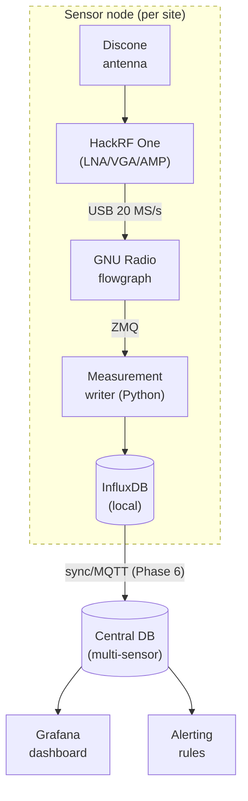
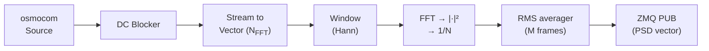

# SDR-Based Spectrum Monitoring System for FM Broadcast Compliance Assessment

#### **Continuous Monitoring of FM Broadcast Using HackRF One**

Project Design Document

September 21, 2026

### **1 Introduction**

#### **Objective**

Design, build, and field-validate a continuously operating spectrum-sensing sensor that monitors FM broadcast services and records per-channel received power and occupancy over time. The system must be low-cost, reproducible, and scalable from one sensor to a network of geographically distributed sensors reporting to a central database.

#### **System Overview**

The sensor chain is:

*Antenna* → *HackRF One* → *GNU Radio DSP* → *measurement writer* → *time-series DB* → *web dashboard*

Figure [1](#page-0-0) shows the end-to-end architecture for both the single-sensor (Phases 0–5) and multi-sensor (Phase 6) configurations.

Figure 1: End-to-end sensor architecture. Dashed box: one sensor site; solid nodes below the dashed box: central services activated in Phase 6.

#### **Scope**

- **In scope:** sensing and logging of FM broadcast occupancy and power; calibration against references; web visualization; multi-sensor aggregation.
- **Out of scope (v1):** demodulation/recording of audio content, transmitter geolocation, real-time regulatory enforcement actions.

## **2 Phase 0 — Requirements, Measurand Definition, and Calibration**

#### **Measurand Definition**

The primary measurands are defined per FM channel *c* with centre frequency *fc* and channel bandwidth *Bc*:

Table 1: Measurand definition.

| Quantity                 | Symbol | Unit       |           | Definition                             |
|--------------------------|--------|------------|-----------|----------------------------------------|
| Channel power            | P c    | dBm        |           | Integrated power over B c = 200 kHz    |
| Noise floor              | P nf   | dBm/Hz or  | dBmin B c | Median power of vacant channels        |
| Occupancy flag           | o c    | boolean    |           | P c > γ (adaptive threshold)           |
| Duty cycle               | D c    | %          |           | Fraction of time o c = 1 over a window |
| Estimated field strength | E c    | dB µ V / m |           | From P c via antenna factor            |
| Full-band scan timestamp | t      | UTC        |           | Start of scan, ms resolution           |

System requirements are summarized in Table [2.](#page-1-0)

Table 2: Top-level requirements.

| ID | Requirement             | Target                             |
|----|-------------------------|------------------------------------|
| R1 | Frequency range         | 87.5–108 MHz                       |
| R2 | Full-band scan period   | ≤ 10 s                             |
| R3 | Occupancy detection     | P fa ≤ 5%, P d ≥ 95% at SNR ≥ 0 dB |
| R4 | Absolute power accuracy | ± 3 dB (post-calibration)          |
| R5 | Frequency accuracy      | ± 5 kHz at 100 MHz                 |
| R6 | Uptime                  | ≥ 95% over a 30-day run            |
| R7 | Scalability             | ≥ 5 sensors feeding one central DB |

### **HackRF One Hardware Characterization**

**Gain chain:** The HackRF receiver path provides three digitally controlled gain stages: RF amplifier (AMP, 0/14 dB, fixed step), LNA (0–40 dB, 8 dB steps), and VGA (0–62 dB, 2 dB steps). Sensing uses **fixed** gains — automatic gain control must remain disabled because AGC destroys absolute-power traceability.

Recommended starting point for a moderate-signal urban/rooftop site: RF amp off (0 dB), LNA = 16 dB, VGA = 20 dB, then adjust per site using the overload checks in Section [9.](#page-7-0)

**Noise figure and dynamic range:** The noise figure is estimated in bench tests using the *gain method*:

| $NF \approx P_{\text{out}}$ (integrated in $B$ ) | $-(-174 + 10 \log_{10} B)$ | $-G_{\text{total}}$ | $[\text{dB}]$ | (1) |
|--------------------------------------------------|----------------------------|---------------------|---------------|-----|
|                                                  |                            |                     |               |     |

where *Pn,*out is the measured output noise power with the input terminated in 50 W, *B* the measurement bandwidth, and *G*total the total applied gain. Target: usable dynamic range ≥ 60 dB with compression no lower than −30 dBm at the antenna port.

**Frequency accuracy.** The stock crystal is specified at roughly ±20 ppm; at 100 MHz this is up to ±2 kHz. This is acceptable for FM channel identification (R5) but the offset must be measured against a known station or reference and stored per device. A TCXO modification or GPSDO is optional and only needed for cross-sensor interference studies.

**Power Calibration:** HackRF reports uncalibrated digital power; a per-frequency calibration offset converts raw measurements to dBm:

$$P_c[\text{dBm}] = P_{c,\text{raw}} + C_{\text{cal}}(f_c), \quad (2)$$

where *C*cal(*f*) is obtained at *N* ≥ 5 frequencies spanning the band, either from a calibrated signal generator or by comparing against a reference receiver (spectrum analyzer, or an RTL-SDR cross-calibrated against a known field). Interpolate linearly between points (in dB). Record the calibration table per device and firmware revision.

**Field-Strength Estimation:** With a calibrated antenna factor *AF*(*f*) for the monitoring antenna:

| $E[\text{dB}\mu\text{V/m}] = P_r[\text{dBm}] + 107 + AF(f)[\text{dB/m}],$ | (3) |
|---------------------------------------------------------------------------|-----|
|---------------------------------------------------------------------------|-----|

since a 0 dBm signal in a 50 W system corresponds to 107 dB*µ*V. *AF*(*f*) is taken from the antenna datasheet or measured in an open-area test against a reference field.

## **3 Phase 1 – Sensor Build (HackRF One + GNU Radio)**

**Flowgraph.** A capture-based flowgraph samples a 20 MHz band per capture; channel selection, filtering, and power integration happen in the DSP stage (Phase 2). A full-band scan uses two captures (Table [3\)](#page-3-0) to cover the FM band. Figure [2](#page-2-0) shows the block topology.

Figure 2: Phase 1 GNU Radio flowgraph topology.

Key source parameters are fixed at build time (Table [3\)](#page-3-0).

A full-band scan comprises two captures. Their union (83–113 MHz) covers the FM band 87.5–108 MHz with margin. The flowgraph retunes between captures or uses two parallel source branches.

Table 3: HackRF source parameters (Phase 1).

| Parameter |          | Value |        | Note   |                            |
|-----------|----------|-------|--------|--------|----------------------------|
| Sample    | rate     | 20    | MS/s   | Per    | capture                    |
| Capture   | 1 centre | 93    | MHz    | Covers | 83–103 MHz                 |
| Capture   | 2 centre | 103   | MHz    | Covers | 93–113 MHz                 |
| Bandwidth |          | 20    | MHz    | HackRF | baseband filter            |
| LNA       | gain     | 16    | dB     | Fixed  | (site-tunable)             |
| VGA       | gain     | 20    | dB     | Fixed  | (site-tunable)             |
| RF        | amp      | Off   | (0 dB) | Enable | only for weak-signal sites |

#### **Bench Bring-up Checklist**

- 1. hackrf\_info and hackrf\_transfer -r CLI smoke test (driver and USB integrity).
- 2. Flowgraph runs 60 s without underruns (UuUu counters zero).
- 3. Log underrun/overrun counters per full-band scan in the writer for watchdog use (Section [9\)](#page-7-0).

### **4 Phase 2 — DSP Pipeline and Validation**

#### **Signal Processing Chain**

**PSD estimation.** The averaged periodogram over *M* FFT frames is

$$\hat{S}_{xx}(k) = \frac{1}{M} \sum_{m=1}^M \frac{1}{N_{FFT} U} \left| \sum_{n=0}^{N_{FFT}-1} w(n) x_m(n) e^{-j2\pi kn/N_{FFT}} \right|^2, \quad U = \frac{1}{N_{FFT}} \sum_n w^2(n), \quad (4)$$

with Hann window *w*(*n*) and *NF F T* = 8192 (≈ 2*.*44 kHz bin width at 20 MS/s). *M* = 20 gives a PSD update time of ≈ 8 ms per capture; with the dual-capture full-band scan the scan period remains well below R2.

**Channel power integration.** Channel power is the band-integrated PSD, not a peak pick:

$$P_c [\text{dBm}] = 10 \log_{10} \left( \sum_{k \in \mathcal{K}_c} \hat{S}_{xx}(k) \Delta f \right) + C_{\text{cal}}(f_c), \quad \Delta f = \frac{f_s}{N_{FFT}}, \quad (5)$$

where K*c* spans the channel allocation *fc* ± 100 kHz.

**Occupancy detection** An **adaptive energy detector** sets the threshold from the local noise floor using robust statistics (median and median absolute deviation):

$$\gamma = \text{median}_{c \in \mathcal{V}}(P_c) + k \cdot 1.4826 \cdot \text{MAD}_{c \in \mathcal{V}}(P_c), \quad o_c = \mathcal{V}\{P_c > \gamma\}, \quad (6)$$

where V is the set of channels classified as vacant in the previous scan and *k* ≈ 4–6 is tuned in Phase 2 validation.

**Upgrade path: cyclostationary detection** FM broadcasts carry a 19 kHz stereo pilot, producing strong spectral correlation peaks at cyclic frequencies *α* = ±19 kHz. An SCD (spectral correlation density) test on candidate channels discriminates true FM emissions from noise, interference, or intermodulation products — implemented as a Phase 5/6 refinement to reduce false alarms near strong transmitters.

**Station identification (ground truth).** Optional RDS demodulation (GNU Radio RDS blocks or the redsea CLI on narrowband-recorded IQ) extracts Program Identification (PI) codes and station names, giving positive station identification for validation in Phase 5.

#### **Validation Against Known References**

**Test signals.** • **T1:** Recorded FM IQ replayed through a second SDR or RF playback path (known power, known frequency).

- **T2:** A locally receivable station with published parameters (frequency, ERP, site coordinates).
- **T3:** An independent reference receiver (RTL-SDR or spectrum analyzer) logging the same band.

**Detector performance.** From *N* annotated scans against ground truth, build the confusion matrix and compute

$$P_d = \frac{TP}{TP + FN}, \quad P_{fa} = \frac{FP}{FP + TN}. \quad (7)$$

Acceptance: R3 (*Pd* ≥ 95%, *Pfa* ≤ 5% at SNR ≥ 0 dB).

**Power and frequency accuracy** • Frequency: detected carrier vs. published frequency; acceptance ±5 kHz (R5).

- Power: difference vs. reference receiver across ≥ 10 channels; acceptance ±3 dB (R4), per Section [2.](#page-1-1)

**Plausibility check via link budget.** For station T2, expected received power:

| $P_r = \text{EIRP-FSPL}(d, f) - L_{\text{clutter}}$ | FSPL [dB] = $20 \log_{10}(d_{\text{km}}) + 20 \log_{10}(f_{\text{MHz}}) + 32.44$ . |
|-----------------------------------------------------|------------------------------------------------------------------------------------|
|                                                     | (8)                                                                                |

Agreement within ±10 dB (allowing clutter uncertainty) confirms the calibration chain end-to-end.

### **5 Phase 3 — Measurement Database**

### **Technology Choice**

**InfluxDB 2.x** is the default: native time-series storage, downsampling (retention policies), and direct Grafana integration. PostgreSQL/TimescaleDB is an acceptable alternative if relational sensor metadata must be colocated.

Table 4: InfluxDB measurements (line-protocol tags/fields).

| Measurement Tags Fields                                 |        |                         |
|---------------------------------------------------------|--------|-------------------------|
| channel_power sensor_id , freq_mhz , location power_dbm |        | , field_dbuvm ,         |
| occupied                                                |        | (bool),                 |
| spectrum sensor_id psd                                  | (float | array / blob sidecar) — |
| optional                                                |        | waterfall history       |
| health sensor_id underruns                              |        | , gain_lna , gain_vga , |
| temp_c                                                  | ,      | uptime_s                |

#### **Schema**

#### **Writer Service**

A small Python daemon subscribes to the flowgraph's ZMQ PUB socket, computes perchannel metrics (Phase 2 math lives here, keeping the flowgraph thin), and batch-writes line protocol (batch size 100, flush 1 s). It also emits the health measurement every full-band scan and includes a reconnect/backoff on ZMQ or DB failure.

### **6 Phase 4 — Web Dashboard**

#### **Grafana Panels**

- 1. **Occupancy heatmap** (primary view): frequency × time, colour = channel power. This is the key broadcast-monitoring display.
- 2. **Live spectrum trace**: current PSD with channel markers and RDS-derived station labels.
- 3. **Per-channel trends**: 24 h power and duty cycle for selected stations.
- 4. **Sensor table**: online status, last scan age, noise-floor drift, underrun counts (multisensor ready).

#### **Alerting Rules**

- Channel silent: occupied false for *T*on-air hours on a station previously *>* 90% duty cycle.
- Out-of-band/anomalous emission: power above threshold outside licensed raster channels.
- Sensor offline: no health point for 3 scan periods.
- Noise-floor drift: median noise floor shifts by *>* 6 dB over 24 h (possible gain fault or interference).

### **7 Phase 5 — Field Validation**

#### **Protocol**

- 1. Select a site with a published FM station list (regulator data: frequency, ERP, transmitter coordinates).
- 2. Run the sensor continuously for 72 h (satisfies R6 partially; extend to 30 days for full R6).
- 3. Independently log the band with the reference receiver (T3) for at least 6 h overlapping the deployment.
- 4. Collect RDS identifications where possible for ground truth.

#### **Metrics and Acceptance**

- **Detection rate:** licensed stations detected / licensed stations expected at the site (an ERP-and-distance filter defines "expected"). Target ≥ 90% of expected stations.
- **Ranking consistency:** Spearman's *ρ* between measured power ranking and predicted ranking (EIRP − FSPL). Target *ρ* ≥ 0*.*8.
- **Stability:** no unrecovered crashes; watchdog restart count logged; disk usage within budget (see Section [8\)](#page-7-1).
- **Error sources documented:** multipath fading (slow power variation of ±10 dB is normal for a fixed link over a day), intermodulation from strong FM signals (check phantom products at 2*f*1 −*f*2 combinations), and front-end overload (add attenuation and re-run if observed).

### **8 Phase 6 — Multi-Sensor Deployment**

#### **Architecture**

Sensor nodes forward data to a central collector via MQTT (topic per sensor: spectrum/<sensor\_id>/channel\_power) with the telegraf/agent or the writer publishing directly over TLS. The central instance runs InfluxDB and Grafana; dashboards aggregate all sensors using the sensor\_id tag.

#### **Time Synchronization**

Cross-sensor comparison requires aligned timestamps:

- Minimum: NTP (Chrony), keeping nodes within tens of ms.
- For interference/correlation studies: GPS PPS or a shared GPSDO; note scan start times with sub-ms precision.

#### **Deployment**

Each node ships as a docker-compose stack: flowgraph + writer + telegraf + (node exporter). Per-node configuration file holds sensor ID, location, calibration table reference, and fixed gains — identical images across sites, configuration via environment.

Storage budget: at 206 channels × 4 fields × 1 full-band scan/5 s, raw channel\_power volume is approximately 60 MB/day/sensor for 4-byte fields and 120 MB/day/sensor for 8-byte fields, before InfluxDB overhead. A 7-day raw retention with 1 h downsampling beyond 7 days keeps long-term storage negligible. Recalculate for site-specific channel count and scan rate.

### **9 Risk Register**

Table 5: Top risks and mitigations.

| Risk                       |        | SeverityMitigation                                    |
|----------------------------|--------|-------------------------------------------------------|
| Absolute power inaccuracy  |        |                                                       |
| (HackRF uncalibrated)      |        |                                                       |
|                            | High   | Per-device calibration table (Sec. 2) ; fixed gains;  |
|                            |        | periodic re-check against a known station (T2).       |
| Front-end overload near    |        |                                                       |
|                            | High   | Monitor for intermod products at 2 f 1 − f 2 ; reduce |
|                            |        | LNA/VGA; add external attenuator; AMP stays           |
|                            |        | off by default.                                       |
| USB dropouts on long runs  | Medium | Log underruns in health ; watchdog (systemd           |
|                            |        | Restart=always); alert on missing health points.      |
| Frequency drift beyond R5  | Low    | Measure per-device ppm offset; log drift trend in     |
|                            |        | health ; optional TCXO upgrade.                       |
| Noise-floor mis-estimation |        |                                                       |
| causing P fa violations    |        |                                                       |
|                            | Medium | MAD-based adaptive threshold; cyclostationary         |
|                            |        | confirmation (Phase 5/6).                             |
| Database disk growth       | Low    | Retention policies and downsampling (Sec. 8)          |

### **10 Phase-Gate Milestones**

======================================================================

#### **Terminology**

- *FFT frame:* one *NF F T* -sample block.
- *PSD update:* averaged periodogram over *M* FFT frames.
- *Capture:* one contiguous IQ block at a single centre frequency.
- *Full-band scan:* one complete measurement across the FM band (one or more captures, depending on coverage).
- *Scan period:* time between consecutive full-band scans.
