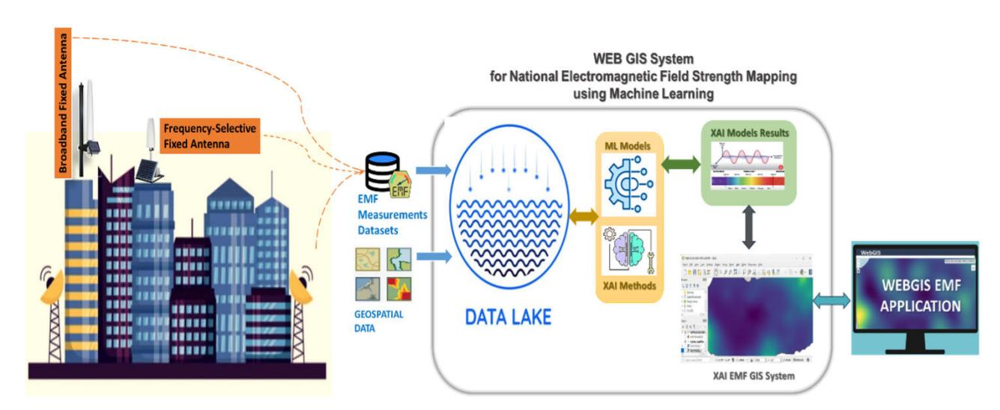
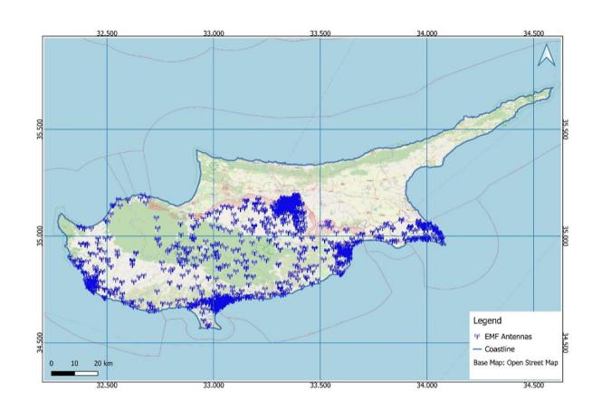
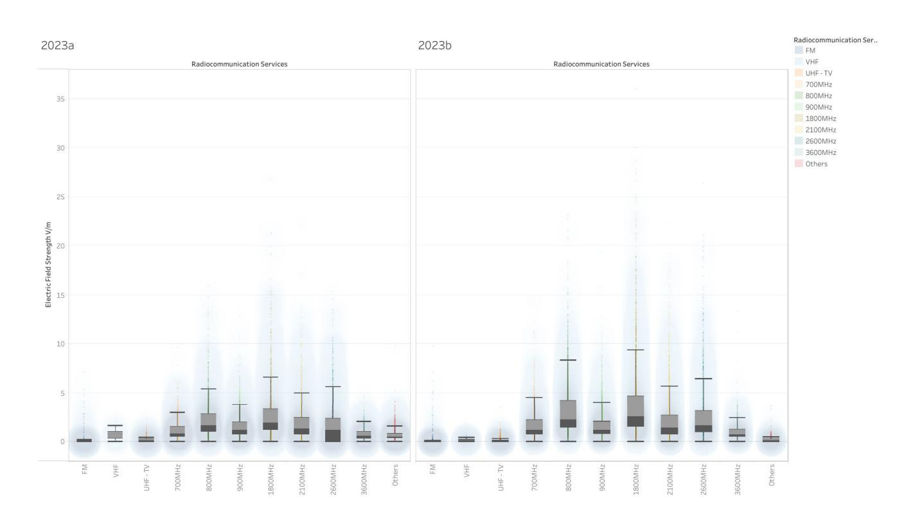
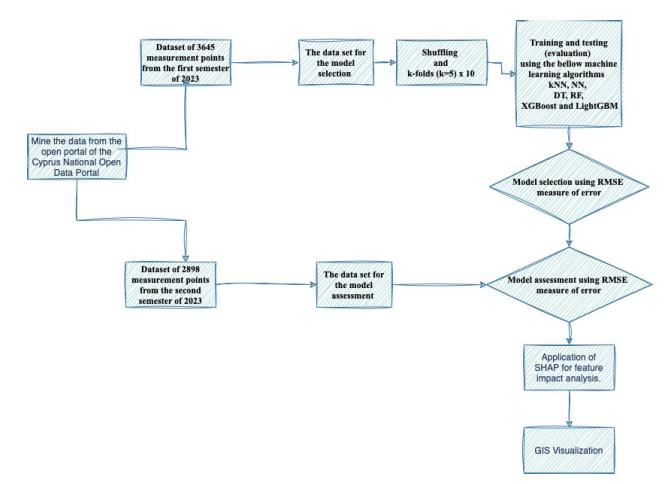
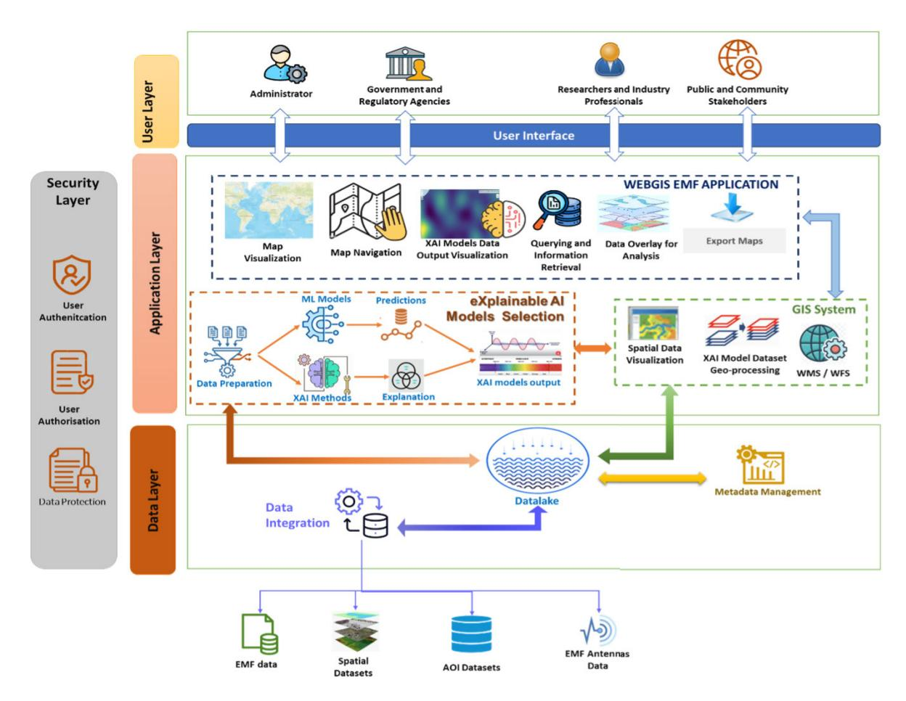
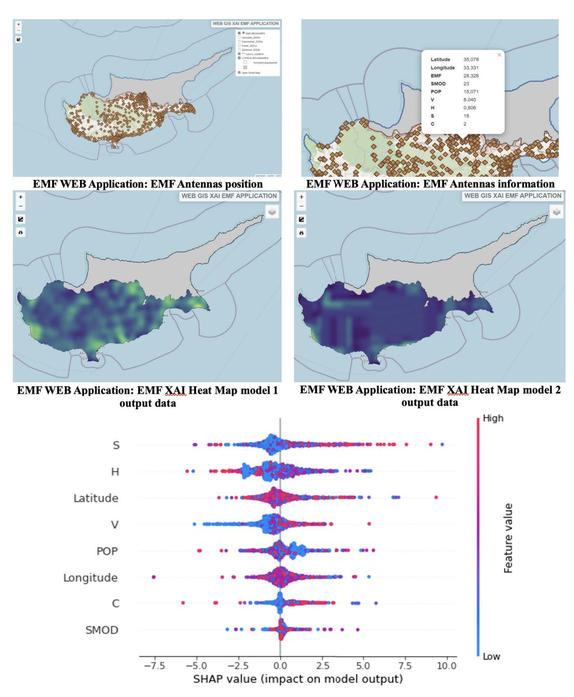
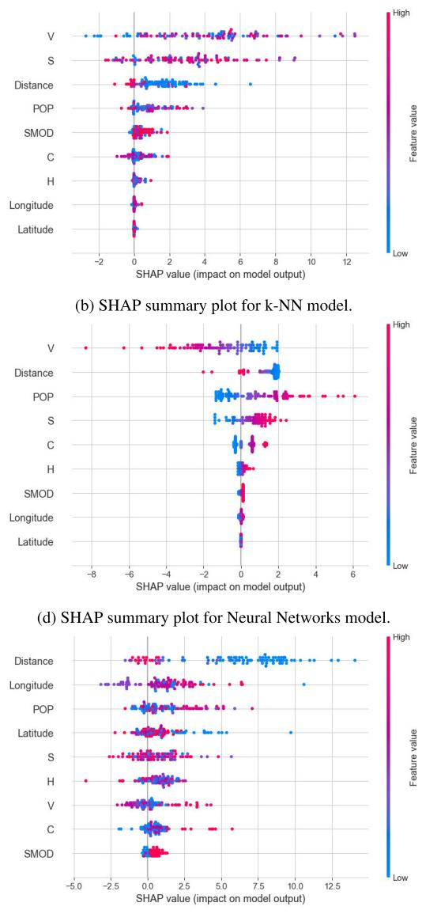
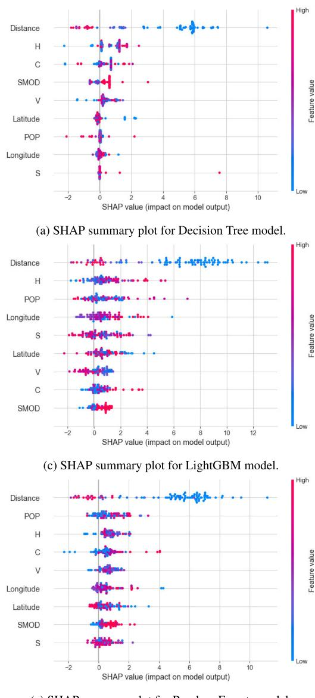

Received 10 April 2025, accepted 23 April 2025, date of publication 28 April 2025, date of current version 5 May 2025.

*Digital Object Identifier 10.1109/ACCESS.2025.3564650*

# Explainable Machine Learning for Radio Environment Mapping: An Intelligent System for Electric Field Strength Monitoring

YIANNIS KIOUVREKI[S](https://orcid.org/0000-0001-6805-3203) 1,2,3, THEODOR PANAGIOTAKOPOULOS4 , EFTHYMIA NOUS[I](https://orcid.org/0009-0005-6009-3143) 5 , IOANNIS FILIPPOPOULOS [6](https://orcid.org/0000-0002-6263-5875) , (Member, IEEE), AGAPI PLOUSSI7 , ELLAS SPYRATO[U](https://orcid.org/0000-0002-7270-4387) 7 , AND EFSTATHIOS P. EFSTATHOPOULOS7

1Mathematics, Computer Science and Artificial Intelligence Laboratory, Faculty of Public and One Health, University of Thessaly, 43100 Karditsa, Greece 2Department of Information Technologies, University of Limassol, 3020 Limassol, Cyprus

3Business School, University of Nicosia, 2417 Nicosia, Cyprus

4Department of Management Science and Technology, University of Patras, 26334 Patras, Greece

5 Infralabs Ltd., 1107 Nicosia, Cyprus

6Technology And Innovation School, University of Limassol, 3020 Limassol, Cyprus

7Department of Applied Medical Physics, Medical School, National and Kapodistrian University of Athens, 11527 Athens, Greece

Corresponding author: Yiannis Kiouvrekis (yiannis.kiouvrekis@gmail.com)

**ABSTRACT** The accurate characterization of signal propagation is critical for optimizing wireless network performance and supporting applications such as electromagnetic field (EMF) exposure assessment and the development of Radio Environmental Maps (REMs). This study proposes a novel, explainable machine learning system to predict electric field strength across diverse urban, semiurban, and rural environments in Cyprus. The system is trained on a rich dataset comprising 6,543 EMF measurements collected in 2023 at mobile phone and digital TV stations, following CEPT/ECC/REC/(02)04 recommendations. The dataset includes geospatial and environmental features such as antenna distance, population density, urbanization level, and detailed built environment characteristics (e.g., volume, surface, and height). We evaluate multiple machine learning models—kNN, neural networks, decision trees, random forests, XGBoost, and LightGBM—using a two-semester split for training and assessment. Best performance was achieved with the Random Forest model, which yielded the lowest RMSE among all models. Gradient boosting models (XGBoost and LightGBM) also performed well, with RMSE values slightly higher than RF while offering flexible and scalable configurations. In contrast, k-NN and neural networks showed higher RMSE values, indicating they were less effective for this specific task. Across all models, confidence intervals were narrow, demonstrating stable and reliable predictions. Explainable AI techniques revealed that antenna distance, building volume, and population density are the most influential predictors of EMF intensity. Our approach outperforms traditional signal models by incorporating urban morphology and demographic context. As part of this system, we also create a Geographic Information System (GIS) that displays electromagnetic field strength maps derived from our explainable machine learning models. This contributes a scalable, interpretable framework for EMF exposure mapping to support regulatory monitoring, urban planning, and smart city initiatives.

**INDEX TERMS** Electric field strength, explainable machine learning, machine learning, radio environment map, WEB GIS.

The associate editor coordinating the review of this manuscript and approving it for publication was Lei Zha[o](https://orcid.org/0000-0003-0975-0943) .

#### **I. INTRODUCTION**

### A. GENERAL CONTEXT

Technological progress has become a defining feature of contemporary society, permeating nearly every aspect of daily life. Among the most transformative developments is the integration of the Internet of Things (IoT), which has enabled the interconnection of countless devices used in virtually all human activities—from home automation and wearable health monitors to industrial sensors and smart city infrastructure. As these technologies have become increasingly embedded in everyday routines, the demand for robust, high-speed, and ubiquitous wireless communication networks has surged dramatically [\[37\]. T](#page-17-0)his growth has been particularly pronounced in the rollout and adoption of mobile communication networks, especially with the global deployment of fifth-generation (5G) systems [\[3\].](#page-16-0) 5G networks promise not only faster data rates but also ultra-low latency and support for massive device connectivity, making them a cornerstone of future digital ecosystems. As a consequence, cities are now increasingly saturated with wireless infrastructure, such as small cells and base stations, designed to provide seamless coverage across dense urban environments. With this massive expansion of wireless networks comes a critical need for accurate models that can predict how electromagnetic signals propagate through various environments [\[45\]. S](#page-17-1)ignal propagation is influenced by a multitude of factors, including terrain, buildings, atmospheric conditions, and the spatial arrangement of antennas. Accurate propagation prediction is therefore essential for optimizing network performance, reducing interference, and ensuring quality of service. More broadly, it plays a central role across multiple scientific and engineering disciplines [\[35\].](#page-17-2) In environmental science, for instance, signal propagation models contribute to the creation of electromagnetic pollution maps, which help assess public exposure to radiofrequency (RF) fields [\[5\]. T](#page-16-1)hese maps are increasingly relevant in the context of growing concerns about the potential health effects of long-term exposure to non-ionizing radiation. In the fields of wireless communications and radio frequency engineering, signal prediction supports the estimation of path loss functions and the development of Radio Environmental Maps (REMs), both of which are critical for network design, capacity planning, and smart city applications [\[19\].](#page-17-3) One concrete application is the planning and placement of base stations to maximize coverage and capacity while minimizing energy consumption and signal overlap. This is particularly vital in the context of 5G networks, which use higher-frequency bands that are more susceptible to signal degradation and require denser infrastructure [\[46\].](#page-17-4) Effective planning relies on precise radio maps that represent the spatial distribution of signal strength or quality across different environments. From a technical perspective, one of the central challenges in wireless communications and RF engineering is to develop models that can accurately describe how signals behave in real-world scenarios [\[31\].](#page-17-5) This often involves the estimation of the path loss function—a mathematical representation of how signal power decreases with distance and environmental factors [\[30\]. T](#page-17-6)hese estimations are foundational for generating various types of radio maps, including power spectrum maps, which are used in spectrum management, and cognitive radio applications [\[33\]. T](#page-17-7)he practical importance of these maps extends directly to the telecommunications industry. Network providers use radio maps to inform strategic decisions regarding the deployment of infrastructure, especially in densely populated or complex urban areas [\[9\]. Fo](#page-16-2)r example, a 5G provider might utilize radio maps to visualize the impact of urban geometry—such as high-rise buildings and narrow streets—on signal propagation, enabling more effective deployment strategies [\[39\].](#page-17-8) Similarly, cognitive radio networks (CRNs) represent a paradigm shift in spectrum management. These intelligent communication systems continuously monitor the RF environment and dynamically adapt their transmission parameters to avoid interference and maximize efficiency [\[20\]. R](#page-17-9)adio maps are essential to the functioning of CRNs, providing the environmental awareness needed for intelligent decision-making. From an environmental and public health perspective, however, the goal is somewhat different. Here, the objective is not only to manage networks efficiently but also to evaluate the exposure levels of electromagnetic fields in residential and public spaces [\[34\]. T](#page-17-10)he growing density of wireless infrastructure has led to an increase in ambient RF fields in many living environments[\[13\], p](#page-17-11)rompting concerns among the public and researchers alike regarding the potential biological and health effects of long-term exposure [\[10\]. A](#page-16-3)lthough non-ionizing radiation is generally considered safe at regulated exposure levels, scientific inquiry into its possible risks remains active and necessary. In recent years, numerous studies have sought to assess the levels of electric field strength across different environments—indoor, outdoor, rural, and urban—to establish baseline exposure levels and inform public policy [\[6\].](#page-16-4) Despite this growing body of research, most studies to date have focused primarily on measuring electromagnetic field strength, often using specialized equipment at fixed locations [\[17\],](#page-17-12) [\[29\]. W](#page-17-13)hile such measurements are invaluable for empirical analysis, they are inherently limited in spatial coverage and scalability. What has been largely missing from the field is the development of predictive methodologies capable of estimating field strength in unmeasured areas particularly at a national or city-wide scale. Moreover, many existing approaches rely on traditional geospatial interpolation techniques, which may not fully capture the complexity of the variables influencing signal propagation, such as urban morphology or human population density. In this context, there is a clear need for the integration of more advanced modeling techniques, such as machine learning, which can leverage large, heterogeneous datasets and uncover non-linear relationships between environmental variables and signal strength. The adoption of explainable AI (XAI) methods further enhances this approach, providing transparency and interpretability to model predictions—an

**FIGURE 1.** The framework of the system.

essential feature when results are to be used in public-facing platforms or regulatory decision-making.

# B. CONTRIBUTION AND SCOPE

The primary objective of this study is to develop a comprehensive information system that enables the accurate prediction, interpretation, and visualization of outdoor electric field strength levels across an entire country using explainable machine learning (XAI) techniques. To the best of our knowledge, this is the first large-scale attempt to combine machine learning models with explainable AI to assess non-ionizing electromagnetic radiation exposure, and to present the results through an integrated Geographic Information System (GIS). The novelty and key contributions of our approach are threefold:

- 1) **Innovative Dataset Integration:** We introduce a unique, enriched dataset combining over 6,500 EMF measurements with geospatial and environmental variables, including population density, urbanization degree, and detailed building morphology. This multidimensional dataset enables more accurate and context-aware predictions compared to traditional signal propagation models.
- 2) **Application of Explainable AI in EMF Mapping:** Our system applies a suite of machine learning algorithms—k-NN, neural networks, decision trees, random forests, XGBoost, and LightGBM—to predict electric field strength. Through explainable AI techniques (e.g., SHAP values), we not only achieve high predictive accuracy but also identify the most influential features (e.g., antenna distance, building volume, and population density), providing actionable insights into the factors influencing EMF exposure.
- 3) **Development of a Scalable, Interpretable GIS Platform:** We create a dynamic Geographic Information System that visualizes electric field strength maps based on interpretable machine learning

outputs. This tool offers transparency, supports informed decision-making for urban planning and public health, and represents a novel integration of XAI in environmental exposure mapping.

In general, this work advances the state of the art by moving beyond black-box prediction models and offering a transparent, data-driven solution for EMF exposure analysis at a national scale.

# **II. RELATED WORK**

# A. RELATED WORK IN WIRELESS COMMUNICATIONS

In [\[18\], t](#page-17-14)he authors propose and evaluate a data-driven, model-free path loss prediction method based on a novel supervised learning approach. Exploring urban propagation, [\[38\]](#page-17-15) introduces new input features derived from image processing tools and presents a model using a set of seven machine learning models, showing improved prediction performance. To model path loss in urban 5G environments, [\[15\]](#page-17-16) implements a deep learning approach, combining a log-distance path loss model for line-of-sight cases with a deep learning model for nonline-of-sight scenarios. For transparency, eight characteristics were selected to model path loss using linear regression, providing insight into the behavior of the deep learning model. Further advancing path loss prediction, [\[30\]](#page-17-6) applies a machine learning approach utilizing data from online sources such as OpenStreetMap to facilitate estimation of cell coverage in urban areas.

The study in [\[14\]](#page-17-17) presents a path loss model that uses multidimensional Gaussian process regression (GPR) to improve spatial consistency in channel predictions, outperforming traditional models, especially with increased spatial correlation. In [\[12\], th](#page-16-5)e authors address the challenge of estimating power spectrum maps (PSMs) due to the difficulty of obtaining accurate radio propagation characteristics. To solve this, they proposed a novel PSM estimation algorithm using generative adversarial networks (GANs). Their MEGANs algorithm learns precise radio propagation features during training rather than relying on potentially inaccurate or biased assumptions typical in traditional methods. The simulation results show that MEGANs provide significantly more accurate estimates than conventional approaches. Finally, [\[11\]](#page-16-6) explores a deep learning-based spectral decision model for cognitive radio networks, using feature extraction to classify three levels of spectral traffic within the spectral occupancy matrix of a primary user, enhancing the efficiency of CRN. In the most recent comparable study [\[16\],](#page-17-18) researchers evaluated 566 machine learning models in eight French cities. Six fundamental algorithms were evaluated: k Nearest Neighbors, XGBoost, Random Forest, Neural Networks, Decision Trees, and Linear Regression. The study highlighted the superior performance of the ensemble methods, particularly Random Forests and XGBoost, which consistently outperformed simpler models. Furthermore, SHAP analysis revealed substantial differences in the rank of importance of features between tree-based methods and other approaches such as k-NN, neural networks, and linear regression, highlighting the unique insights provided by the ensemble models.

# B. RELATED WORK IN ENVIRONMENT

Environmental models for decision making are used in various environmental fields, and in each of these fields there are many different types of model, each incorporating various characteristics to describe the behavior of the natural system. Spatial environmental models, such as creating a map of electric strength from multiple sources, are typically the result of the interaction of multiple components with errors that do not exhibit predictable properties, making traditional hypothesis testing associated with statistical inference less suitable due to the strong assumptions often required and the difficulty, and sometimes impracticality, of testing hypotheses separately [\[5\].](#page-16-1)

Each attempt to model the level of electromagnetic radiation has unique goals and challenges, and due to its enormous complexity, there is no ideal or standardized evaluation technique that can be applied to all models. However, machine learning, especially in recent years, has demonstrated its capabilities in fields such as physics. More specifically, in recent years, efforts have been made to utilize machine learning techniques in this context.

In [\[43\],](#page-17-19) the research focuses on evaluating the electromagnetic field (EMF) exposure emanating from base stations (BSs) within urban city environments. The authors employ artificial neural networks (ANNs) to reconstruct EMF exposure levels based on data collected from sensors. Their approach takes into account various factors, including the spatial locations of actual BSs in the 14th district of Paris, temporal variations, and antenna orientations. A novel approach was introduced in [\[4\], fo](#page-16-7)r determining the power density value, which serves as the standard for measuring human exposure to radio frequency (RF) electromagnetic fields (EMF) emitted by mmWave mobile devices. They accomplish this using a deep learning network. Authors in [\[27\]](#page-17-20) present an algorithm that utilizes the U-net architecture, based on convolutional neural networks, to create electromagnetic field exposure maps. This model is designed to understand the propagation patterns of wireless signals within real indoor environments, considering the various positions of Wi-Fi access points. The results of their study show that it is feasible to learn indoor propagation characteristics and environmental models from the data, ultimately leading to the generation of precise power maps to measure electromagnetic fields.

The use of a conditional generative adversarial network to accurately reconstruct the electromagnetic field exposure map based on the topology of an urban environment in the outdoors has been proposed in [\[28\]. T](#page-17-21)he authors achieve this by training the model to understand and estimate how the electromagnetic field propagates in relation to the given environment's topology. The work also compares this approach with a simpler technique called kriging where the results demonstrate that the proposed method provides precise estimates and holds promise as a solution for reconstructing exposure maps. In [\[42\], t](#page-17-22)he authors use an artificial neural network (ANN) model to perform a spatial reconstruction of radiofrequency (RF) electromagnetic field (EMF) exposure in an urban outdoor setting. They construct ANN models using input data that include details about distances to N neighboring base stations (BS), receiver locations, and temporal variations.

The proposed model demonstrates the ability to predict exposure levels effectively without becoming overly complex. An innovative artificial neural network (ANN) model presented in [\[40\]](#page-17-23) designed to estimate Uplink transmit power is. They achieve this by using readily available parameters, including downlink connection indicators and information about the indoor environment. Using these easily accessible input features, the proposed ANN model can accurately estimate the transmit power of Uplink, achieving a mean absolute error (MAE) of 1.487 dB.

In [\[44\], th](#page-17-24)e authors conducted a study on the time and space mapping of electromagnetic field (EMF) exposure caused by cellular base station antennas (BSA). To this end, they used artificial neural networks (ANN) for this purpose. In [8] [the](#page-16-8) authors presented a novel machine learning-based approach for forecasting the resulting uplink transmission power used for data transmissions based on the available passive network quality indicators and application-level information. Alos, the authors of an article [\[41\]](#page-17-25) presented a novel machine learning method based on Neural Networks (NN) to generate an electromagnetic map of radio-frequency (RF) exposure generated by WiFi sources in indoor scenarios.

# **III. TOOLS AND METHODS**

# A. DATASET

The initial data set comprises open data sourced from data.europa.eu, the official portal for European data [\[2\], th](#page-16-9)e

**TABLE 1.** Frequency bands and descriptions.

| Code                     | Zone Description                                                                                  | Frequency                    |
|--------------------------|---------------------------------------------------------------------------------------------------|------------------------------|
| M                        | Radio Broadcasting Zone                                                                           | 87.5 - 108 MHz               |
| VHF                      | Very High Frequency (excluding FM)                                                                | 30 – 87.5 MHz, 108 - 300 MHz |
| UHF TV                   | Terrestrial Digital Television Zone                                                               | 470 - 790 MHz                |
| 700                      | Mobile Telephony Zone                                                                             | 694 - 790 MHz                |
| 800                      | Mobile Telephony Zone                                                                             | 791 - 821 MHz                |
| 900                      | Mobile Telephony Zone                                                                             | 925 - 959.8 MHz              |
| 1800                     | Mobile Telephony Zone                                                                             | 1805.2 – 1880 MHz            |
| 2100                     | Mobile Telephony Zone                                                                             | 2110 – 2170 MHz              |
| 2600                     | Mobile Telephony Zone                                                                             | 2620 – 2690 MHz              |
| 3600                     | Mobile Telephony Zone                                                                             | 3400 – 3800 MHz              |
| <i>Other Frequencies</i> | All frequency gaps within the spectrum of 30 MHz – 6 GHznot included in the above frequency zones | -                            |

data is also available on the Cyprus National Open Data Portal, a platform that offers access to various open data sets related to the country [\[1\]. Th](#page-16-10)e measurements of electromagnetic fields were performed via portable IoT devices at all installed mobile phone stations (Cyta and Epic) and at all digital television stations. The methodology used by the Department of Electronic Communications of the Ministry of Research, Innovation and Digital Policy of Cyprus is the following: Three measurements were taken at points in the environment surrounding each telecommunications station where maximum values of the exposure value to electromagnetic radiation are expected. Such points are those located at elevated positions near the telecommunications station and in the direction of the central emission axis, and the three measurements were taken at different distances each time. Additionally, the methodology used is described in Recommendation CEPT/ECC/REC/(02)04 titled ''Measuring Non-Ionizing Radiation (9kHz - 300 GHz)''. Measurements of electric field intensity are made on the three propagation axes of the signal (x, y, z). For the assessment of the worstcase scenario, the electric field intensity values considered are the maximum values recorded for each emission, not the average for the 6-minute period, as provided for in the above recommendation. At each point, measurements are taken from all contributing sources of electromagnetic radiation.

The initial data set comprises 6543 measurements conducted throughout the territory of the Republic of Cyprus in 2023, furthermore, Figure [2](#page-4-0) shows the distribution of measurement points. The frequency spectrum of the investigated radiocommunication services is shown in Table [1.](#page-4-1) The total measurements were taken in both semesters of 2023. In the first semester of 2023, 3645 measurements were taken, which will form the entire data set for model selection. The measurements of the second semester of 2023, which number 2898, will be used for model assessment of the selected models. Cyprus is the third largest island in the Mediterranean Sea and spans dimensions of 240 kilometers (149 miles) in length from one end to the other and of 100 kilometers (62 miles) width at its widest point. It is situated between latitude 34*o* - 36*o* N and longitude 32*o* - 35*o* E (Figure [2\)](#page-4-0). Data processing tasks were carried out using a combination of Python libraries, which provided enhanced flexibility and a range of tools to present the results obtained.

**FIGURE 2.** Dataset distribution.

Figure [3](#page-5-0) presents a comparative box plot analysis of electric field strength (measured in V/m) across different radiocommunication services for the first and second semesters of 2023, labeled as 2023a and 2023b, respectively. Each subfigure depicts the distribution of electric field strength values for various frequency bands, ranging from low-frequency services such as FM, VHF, and UHF-TV, to higher-frequency cellular bands including 700 MHz, 800 MHz, 900 MHz, 1800 MHz, 2100 MHz, 2600 MHz, and 3600 MHz. A final category, labeled ''Others,'' aggregates remaining frequencies outside the primary bands. Overlayed density plots and individual data points provide additional insight into the distributional shape and variability within each band. In both semesters, cellular communication bands—particularly from 800 MHz to 2600 MHz consistently exhibit higher electric field strength values compared to the lower-frequency bands. These cellular bands not only demonstrate elevated median values but also larger interquartile ranges and more frequent outliers, with maximum values occasionally exceeding 25 V/m. Among them, the 800 MHz and 1800 MHz bands show particularly broad distributions, which is likely a reflection of widespread LTE infrastructure deployment in both urban and semiurban environments. This variation indicates a high level of spatial and situational diversity in signal strength for these frequencies. The 3600 MHz band, which is commonly associated with 5G networks, shows relatively lower field

**FIGURE 3.** Distribution of electric field strength (V/m) by radiocommunication service for the first (2023a) and second (2023b) semesters of 2023.

strength levels and a narrower spread in both time periods. This is indicative of its more limited deployment during the study period. However, a slight increase in both median values and distribution width from 2023a to 2023b may reflect early-stage expansion of 5G infrastructure within the observed regions. By contrast, the low-frequency bands— FM, VHF, and UHF-TV—exhibit much lower electric field strength levels, with tight box plots and relatively few outliers. These bands appear to contribute minimally to overall EMF exposure, likely due to reduced usage or their legacy status in modern communication systems. Comparing the two semesters, overall trends remain relatively stable.

The final dataset is enriched in a way such that it consists of 8 variables (Table [2\)](#page-6-0). The first variable 'Distance' represents the distance of each antenna. The second variable, the target variable, 'EMF' pertains to the overall value (the squared sum from all bands)

$$\text{EMF} = \sqrt{E_M^2 + E_{VHF} + \dots + E_{3600} + E_{\text{other}}} \quad (1)$$

of the electromagnetic field, measured in units of V/m, according to the table [1.](#page-4-1) The third variable, 'SMOD,' is a variable with 8 values indicating the urbanization degree of a specific area [\[26\]. T](#page-17-26)he fourth variable is 'POP,' which represents the population residing around the antenna in a 100 × 100-meter square area. These data have been extracted from the spatial raster data set [\[36\], w](#page-17-27)hich illustrates the distribution of residential population, quantified as the number of people per cell. The fifth variable, 'BUILT-V,' is derived from the spatial raster data set that illustrates the distribution of the built-up volumes, measured in terms of the number of cubic meters [\[25\]. T](#page-17-28)he sixth variable BUILT-S is derived from the spatial raster data set that shows the distribution of the built-up surfaces, expressed as the number of square meters [\[24\]. T](#page-17-29)his data provides information about the total built-up surface and the portion of the built-up surface allocated to dominant non-residential (NRES) uses. The seventh variable 'BUILT-H' is related to the heights of the building and is derived from the spatial raster data set that depicts the spatial distribution of the heights of the building per cell [\[22\]. T](#page-17-30)he last variable 'BUILT-C' is derived from the 'GHS-BUILT-C' spatial raster data sets, which delineate the boundaries of human settlements at a 10-meter resolution [\[23\]. T](#page-17-31)his variable describes the inner characteristics of settlements in terms of the morphology of the built environment and its functional use.

# B. PREPROCESSING DATA

# 1) STANDARDIZATION

To ensure the robustness of our method, we standardized the data using the z-score method. This method involves subtracting the mean value from each data point and then dividing by the standard deviation. The result is a new dataset where each feature has a mean of zero and a standard deviation of one. This process puts all features on the same scale, making it easier for machine learning models to learn effectively. We perform z-score standardization separately for

**TABLE 2.** Description of variables in the final dataset.

| Variable length | Description                                                                             | Unit / Categories            | Stock |
|-----------------|-----------------------------------------------------------------------------------------|------------------------------|-------|
| Distance        | Distance from the measurement point to the nearest antenna                              | Metrs                        | –     |
| EMF             | Total electromagnetic field strength (sum of squared values across all frequency bands) | V/m                          | –     |
| SMOD            | Degree of urbanization, classified into 8 categories                                    | Categorical (8 levels)       | [26]  |
| POP             | Population within a 100×100 m 2 area around each antenna                     | People per cell              | [36]  |
| BUILT-V         | Volume of built-up areas within each cell                                               | Cubic meters                 | [25]  |
| BUILT-S         | Surface area of built structures, including total and non-residential portions          | Square meters                | [24]  |
| BUILT-H         | Height of buildings within each spatial cell                                            | Meters                       | [22]  |
| BUILT-C         | Characteristics of human settlements, including morphology and functional use           | Morphological classification | [23]  |

each training dataset we used. This ensures that the models are trained and evaluated using data that has been scaled consistently.

### 2) SAMPLING

Following our earlier discussion, data was collected across both semesters of 2023. A total of 3645 measurements were obtained in the first semester and will be utilized for model training and selection. The remaining 2898 measurements from the second semester will be reserved for independent model evaluation. During the model selection procedure, we use a combination of two techniques within the selection data 80%. We shuffle the 80% data and split it into training and validation sets (80% training, 20% validation). Within each training set from the previous step, we perform 5-fold cross-validation, and standardization, described in Section [III-B1,](#page-5-1) for each split for the 5-cross validation split. Here, the training data is further divided into 5 folds. We train the model on 4 folds (80%) and test it on the remaining fold (20%), repeating this process for all 5 folds. This ensures every data point is used for both training and testing. This is done 10 times to create 50 training-validation pairs overall. Once we have the best model from the selection process, we use a new dataset, the dataset of the second semester of 2023 (model assessment dataset), to evaluate its final performance. The entire process is illustrated for more clarity in Figure [4](#page-6-1) for a clearer picture. This rephrased version uses simpler language, avoids technical jargon where possible, and provides analogies to make the concepts easier to understand.

# C. MACHINE LEARNING ALGORITHMS

The issue we need to tackle involves forecasting the levels of electromagnetic radiation in outdoor environments, including urban, semi-urban, and rural areas, each with distinct topographical characteristics. To address this, we will use machine learning techniques. Machine learning is an umbrella term for a set of data analysis methods that can automate the development of models. It is a branch of artificial intelligence based on the idea that systems can be trained using a data set to identify patterns and make decisions with minimal human intervention.

**FIGURE 4.** The flowchart of the model selection's methodology.

A suite of machine learning algorithms, including k-Nearest Neighbors (kNN), Neural Networks (NNs), Decision Trees (DT), Random Forests (RF), and XGBoost, were used to model spatially distributed electric field strength. This selection balanced simplicity, interpretability, robustness, and the ability to capture non-linear relationships. kNN served as a baseline for spatial patterns, NNs for complex interactions, DT for feature analysis, RF for noise robustness, and XGBoost for accuracy. Explainable AI was used to understand feature importance.

#### 1) K-NN

The k-NN algorithm is notable for its simplicity among machine learning methods. For classification tasks, it assigns a category based on the majority category of the k nearest neighbors. In regression problems, it estimates values using a weighted mean function, represented by the formula ˆ*f* (*x*) = P*k i*=1 *f* (*xi*) *k* , where ˆ*f* (*x*) denotes the estimated value. Alternatively, more advanced functions can be employed, such as weighting by the inverse of distances

$$\hat{f}(\vec{x}) = \begin{cases} \sum_{i=1}^k \frac{w_i(x_1, \dots, x_k) f(x_i)}{\sum_{i=1}^k w_i(x_1, \dots, x_k)} & \text{if } d(\vec{x}, \vec{x}_i) \neq 0 \quad \forall i \leq k \\ f(x_i) & \text{otherwise} \end{cases} \quad (2)$$

or some more mathematically complex distance functions like exponentially weighted by distance or using a Gaussian function (Gaussian kernel). Additionally, within the k-NN algorithm, we have the flexibility to change the distance function. A common approach involves exploring various values for the Minkowski distance (equation [3\)](#page-7-0),

$$d(\vec{x}, \vec{y}) = \left( \sum_{i=1}^n |x_i - y_i| \right)^{\frac{1}{p}} \quad (3)$$

which allows for adapting the distance metric to better suit the characteristics of the dataset. IIn this study, we set the number of neighbors (k) to be the set {5, 6, 7, 8, 9, 10, 15, 20, 25}, determining how many nearest neighbors are considered for predictions. Additionally, we optimized two hyperparameters to enhance model performance: first, for the distance function, we utilized the Minkowski distance with *p* ∈ {1, 2, 3}. Secondly, for the weight function, we adopted two approaches: assigning equal weight to all points within each neighborhood, and weighting points inversely by their distance.

#### 2) NEURAL NETWORKS

Neural networks, a cornerstone of modern machine learning, will be introduced. Despite their recent surge in popularity. Inspired by the biological neuron, McCulloch and Pitts pioneered the concept of artificial neural networks. A McCulloch and Pitts neuron is a function *f* : R *d* 7→ {0, 1} with

$$f(x_1, \dots, x_d) = \mathbb{I}_{\mathbb{R}^+} \left( \sum_{i=1}^d w_i x_i - \theta \right) \quad (4)$$

where *wi*, θ are real numbers, *d* is a natural number and IR+ is the real function with IR+ = 0 for *x* < 0 and IR+ = 1 for *x* ≥ 0. In terms of the neural network framework, the function IR+ is called the activation function, θ called threshold and *wi* is called weights. A more sophisticated model is the multilayer perceptron, which is the fundamental construction, and in this research we will use the scheme of [''Theory of Deep Learning'' by Cambridge University Press]. A fully connected feedforward network is given by its architecture (*N*, ρ) where *L* ∈ N, *N* ∈ N *L*+1 , and ρ : R 7→ R. ρ activation function, *L* is the number of layers and *N*0,*NL*,*Nl* , with *l* ∈ [1, *L* − 1] ⊂ N, is the number of neurons in the input, output and the *l*-th hidden layer, respectively. Let us denote the number of parameters by *P*(*N*) := X *L l*=1 *NlNl*−1 + *Nl* . Then we can define the corresponding realization fucntion 8*a* : R *N*0 × R *P*(*N*) 7→ R *NL* which satisfies that for every input *x* ∈ R *N* 0 and parameters θ, where θ = θ (*l*) *L l*=1 = *W*(*l*) , *b* (*l*) *L l*=1 ∈ Q*L l*=1 R *Nl*×*Nl*−1] × R *Nl* , the last means that for every *l* the *W*(*l*) is a real matrix and *b* (*l*) a vector, where 8*a*(*x*, θ) = 8(*L*) (*x*, θ) and

| $\Phi^{(1)}(\mathbf{x}, \theta) = W^{(1)}\mathbf{x} + b^{(1)}$ | (5) |
|----------------------------------------------------------------|-----|
|----------------------------------------------------------------|-----|

$$\Phi^{(l)}(\mathbf{x}, \theta) = \rho \left( \Phi^{(l)}(\mathbf{x}, \theta) \right) \text{ with } l \in [1, L-1] \quad (6)$$

$$\Phi^{(l+1)}(\mathbf{x}, \theta) = W^{(l+1)}\hat{\Phi}^{(l)}(\mathbf{x}, \theta) + b^{(l+1)} \text{ with } l \in [1, L-1] \quad (7)$$

and ρ is applied componentwise. Also, we refer to the matrices *W*(*l*) as the weighted matrices and to the vectors *b* (*l*) as the bias vectors. Additionally, we refer to 8ˆ (*l*) and 8(*l*) as activations and pre-activations functions of the *Nl* neurons in the *l*-th layer. The width and the depth of the neural networks are defined as ∥*N*∥∞ and *L* respectively. In the present study, we used four hyperparameters tuned to optimize the performance of the model. Specifically, the hidden layers took the following values: {2, 5, 10, 20}. The learning rate varied within the range: {0.1, 0.5, 1}. The next hyper parameter was the solver, which could be either 'sgd' which refers to stochastic gradient descent and 'adam' which refers to an other stochastic gradient-based optimizer. Additionally, we experimented with different activation functions, including 'relu', 'identity', 'logistic', and 'tanh'.

#### 3) DECISION TREES (DTs)

Decision Trees represent a non-parametric supervised learning method that can be applied to both classification and regression tasks. Essentially, a decision tree is a predictive model *p* : X 7→ Y, where X denotes the feature space and Y represents the discrete output space, often binary with Y = {0, 1}. The tree makes decisions by splitting data based on feature values or predefined rules. Its goal is to construct a model that predicts a target variable by deriving simple decision rules from the features in the dataset. Fundamentally, a decision tree offers a piecewise constant approximation of the target variable. As a hierarchical decision support tool, it outlines decisions and their potential outcomes, including chance events, resource distribution, and utility evaluations. Additionally, decision trees have several hyperparameters that can be adjusted to optimize model performance. In this study, we focused on tuning only the depth of the tree, with possible values ranging from {2, 3, 4, · · · , 20, 25, 30, 35, 40}.

# 4) RANDOM FOREST (RF)

Random Forest is a powerful machine learning technique that combines multiple decision trees to enhance prediction accuracy and stability. It excels in handling various datasets, including those with mixed data types and missing values. During training, the algorithm builds an ensemble of trees. Each tree is trained on a random subset of the data (drawn with replacement - a process known as Bagging) and considers only a random selection of features for splitting at each node. This dual randomness minimizes the dependence between trees, preventing overfitting and improving the model's ability to generalize well to unseen data. Random Forest also offers valuable insights into the importance of different features. By analyzing how much each feature contributes to the impurity reduction across all trees, the algorithm determines its significance. This feature importance measure aids in understanding the underlying relationships within the data

Importance(
$$j$$
) =  $\sum_{\text{Splits on } j} \Delta \text{Impurity}$  (8)

where 1Impurity is the reduction in impurity due to a split and is computed as:

$$\Delta \text{Impurity} = I_{\text{parent}} - (w_{\text{left}} \cdot I_{\text{left}} + w_{\text{right}} \cdot I_{\text{right}}) \quad (9)$$

where:

- *I*parent: Impurity of the parent node.
- *I*left, *I*right: Impurities of the left and right child nodes.
- *w*left, *w*right: Proportions of samples in the left and right child nodes, respectively.

thus, the term 1Impurity measures the ''purity gain'' obtained by a split, attributing this gain to the feature responsible for the split. Afterwards, the algorithm aggregates the predictions of individual trees, using majority voting for regression b*f* (*x*⃗) = *N* P*N i*=1 Tree*i*(**x**) , in order to provide a robust final prediction. The hyperparameters in the random forest algorithms dictate the construction and combination of decision trees, ensuring a balance between bias, variance, and computational efficiency. In this study, we focus on tuning the number of trees in the forest (*n*estimators) and the criterion used to evaluate the splits (criterion). The possible values for *n*estimators were set to {10, 50, 100}, and for criterion, the options considered were {squared\_error, absolute\_error,friedman\_mse, poisson}.

#### 5) XGBOOST AND LIGHTGBM

XGBoost falls into the category of tree boosting, a highly effective and widely used machine learning method. Specifically, XGBoost is a scalable end-to-end tree booster that has gained significant popularity among data scientists for delivering state-of-the-art results in numerous machine learning challenges [\[7\]. Li](#page-16-11)ghtGBM, which stands for Light Gradient-Boosting Machine, is a high-performance, opensource framework for gradient boosting that leverages tree-based learning algorithms. Originally developed by Microsoft, LightGBM is widely used for tasks such as ranking, classification, and other machine learning applications. The framework implements various boost techniques, including Gradient Boosting Trees (GBT), Gradient Boosting Decision Trees (GBDT), Gradient Boosted Regression Trees (GBRT), Gradient Boosting Machine (GBM) and Multiple Additive Regression Trees (MART). Designed for efficient and distributed computation, LightGBM offers several advantages, including faster training speeds, lower memory usage, enhanced accuracy, and support for parallel, distributed, and GPU-accelerated learning. Furthermore, its capability to handle large-scale datasets makes it an excellent choice for modern machine learning challenges. Four key settings play a crucial role in XGBoost:

- Number of Estimators: This determines how many decision trees will be built and combined in the final model. More trees can lead to better accuracy, but also increased complexity and risk overfitting.
- Learning Rate: This controls how much each individual tree contributes to the final prediction. A lower learning rate makes the model more conservative and potentially more robust.
- Lambda (L2 regularization): L2 regularization term on the weights helps prevent overfitting.
- Depth: This defines the maximum complexity of each decision tree within the ensemble. Deeper trees can capture more intricate patterns, but also risk overfitting.

Similar, for the LightGBM, the following key settings play a crucial role:

- Number of Leaves: Maximum number of leaves in one tree (affects model complexity and speed).
- Number of Estimators: Number of boosting iterations (trees) to build.
- Learning Rate: Controls the contribution of each tree.
- Depth: This defines the maximum complexity of each decision tree within the ensemble. Deeper trees can capture more intricate patterns, but also risk overfitting.

For XGBoost, the hyperparameters were tuned with the following options:

- λ ∈ {1, 5, 10}, the L2 regularization term.
- *n*estimators ∈ {50, 100, 500};
- Learning rate ∈ {0.1, 0.5};
- max\_depth ∈ {5, 10, 20};

For LightGBM, the hyperparameters were tuned with the following options:

- num\_leaves ∈ {10, 50, 100, 150};
- *n*estimators ∈ {100, 300, 500};
- Learning rate ∈ {0.1, 0.5};
- max\_depth ∈ {5, 10, 20};

#### D. ACCURACY CRITERIA

There are numerous potential numerical calculations associated with modeling sample errors, and the most commonly used is the mean square error (MSE). Ideally, this value should be zero, the Mean Square Error as criterion involves squaring the differences before calculating the mean, ensuring that all contributions are positive and assigning a higher penalty to larger errors. This approach may better fit user concerns. In addition, we will use the Root Mean Square Error (RMSE), which is derived by taking the square root of the MSE, allowing the error metric to be expressed in the same units as the original data. In our error calculations, we will utilize both MSE and RMSE.

The Mean Squared Error (MSE) is a metric in statistics to quantify the accuracy of predictions or models. MSE calculates the average of the squared differences between the actual values and the predicted values. The formula for calculating MSE for a dataset of size *n* is the following:

$$\text{MSE} = \frac{1}{n} \sum_{k=1}^n (y_i - \hat{y}_i)^2 \quad (10)$$

where *yi* are the real values andb*yi* are the predicted values.

Root Mean Squared Error is the square root of Mean Squared error, which provides a measure of the average prediction error in the same units as the data we are trying to predict. The formula is the following:

$$\text{RMSE} = \sqrt{\frac{1}{n} \sum_{k=1}^n (y_i - \hat{y}_i)^2} \quad (11)$$

# E. SHAPLEY ADDITIVE EXPLANATIONS

The more complex a machine learning model's design, the harder it is to understand. Deep learning is a prime example, where neural networks involve complex math that can be challenging for non-experts to grasp. As artificial intelligence and machine learning are used more and more in various applications, explaining how these models work has become increasingly important. This has led to the development of new techniques such as LIME [\[32\]](#page-17-32) and SHAP [\[21\],](#page-17-33) which bring explainability in machine learning to the field. To understand the new framework, let us first clarify what we mean by'model' in this framework.

A set *X* ⊂ R is called *linearly separable* if there exists a hyperplane *H* such that *H* can separate the set *X* into two subsets *A* and *B*. More formally, for any two points *x*1, *x*2 in *X*, if *x*1 belongs to subset *A* and *x*2 belongs to subset *B*, then *H* can be represented as a linear function such that:

$$H(x) = w^T x + b \quad (12)$$

where *w* is called the weight vector. If *H*(*x*) > 0, then *x* belongs to subset *A*, otherwise, it belongs to subset *B*. We have data to sort into two categories, such as categories A and B. A common approach is to represent these data on a dimensional surface, like a plane. Each data point represents a dot, and its color would show its category.

$$\phi_0 + \sum_{i=1}^n \phi_i z'_i.$$

Now, we can introduce the idea of a model. In this context, a model is like a dividing line on this plane that separates the dots in category A from those in category B. Mathematically, this line can be represented by an equation such as the following:

$$m(x) = a_1x_1 + a_2x_2 + \dots + a_nx_n + c \quad (13)$$

Imagine all the possible dividing lines that we could draw on the plane to separate the data. These lines together form a category that we can call ''models.'' Our goal is to find the optimal dividing line among them, following certain rules, often minimizing some kind of error.

Now, let's introduce a new idea in machine learning: the ''explanation model.'' Based on SHAP [\[21\],](#page-17-33) it's another model itself, but simpler and easier to understand than the original complex one.

We can think of it like this: sometimes it's easier to analyze a problem using a simpler version. Similarly, we can transform the original data *x* (like lowering the resolution of an image) into a simpler format *x* ′ using a transformation *x* = *hx* (*x* ′ ) while keeping the important details for the task.

Once we have this simplified data, we can use the explanation model to understand how the original model works. This explanation model is typically simpler, making it easier to understand how it makes its decisions. Our framework uses a specific type of explanation model that relies on adding up the contributions of *additive feature attribution methods* which have an explanation model that is a linear function:

$$g(z') = \phi_0 + \sum_{i=1}^n \phi_i z'_i \quad (14)$$

where *z* ′ are binary variables, *n* is the number of simplified input features and φ*i* called attribute effect. In the framework of SHAP, the main aim is to understand the impact of each feature on the model's output. This involves assessing how the output of the model changes as we vary the input features. The mathematical background of this method has its origin in game theory, more specifically the *SHapley regression values*, which express the importance of each feature for linear models. This method calculates each attribute's effect as follows:

$$\phi_i = \sum_{S \subseteq F \setminus \{i\}} \frac{|S|! (|F| - |S| - 1)!}{|F|!} [f] \quad (15)$$

where *fA* is the model over the subset *A* ⊆ *F* of feature set *F*. All these methods which belong to additive feature attribution methods have the following properties:

- Local accuracy: When the transformation *hx* (*x* ′ ) is identified with *x*, then the explanation model *g*(*x* ′ ) matches with the original model, i.e. *f* (*x*) = *g*(*x* ′ ) = φ0 + X*n i*=1 φ*iz* ′ *i* .
- Missingness: Simply, if *x* ′ *i* = 0, then φ*i* = 0. This means that when *x* ′ *i* = 0, this feature has no attributable impact. Missingness implies that a missing feature gets an attribution of zero.
- Consistency: The values remain constant unless there is a change in the contribution of a feature. In simple terms, the consistency property implies that if a feature becomes more important in making predictions, its Shapley value should also increase or stay the same.

# F. THE PROPOSED SYSTEM

The proposed system is designed to facilitate the cartographic composition of GIS maps and the development of an EMF Web GIS information system. This system aims to transform the data collected by researchers and XAI models into clear and interpretable information. It is crucial for empowering a wide range of stakeholders—including ordinary citizens, researchers, and public agencies—with the tools to access, analyze, and visualize electromagnetic radiation data. By providing these capabilities, the system enables stakeholders to make well-informed decisions, enhance public safety, and support effective planning and policy development. Moreover, the GIS system plays a critical role in visualizing and analyzing the spatial distribution of electromagnetic radiation, identifying potential risk areas such as high-exposure zones and system interferences. This information is essential for making informed decisions related to antenna placement, ensuring regulatory compliance, and addressing public health concerns. Therefore, ensuring the accuracy, clarity, and completeness of the GIS maps is crucial to achieving the objective of designing and implementing a Interpretable Machine Learning System for National Electromagnetic Field Strength Mapping. A robust GIS system is pivotal in this endeavor, as it not only facilitates informed decision-making but also plays a critical role in the effective management of electromagnetic radiation from antennas. Through its precise spatial analysis and visualization capabilities, the GIS system enables stakeholders to efficiently identify potential risk areas, optimize antenna placement, and ensure regulatory compliance, thereby enhancing the protection of both the environment and public health. Moreover, through a user-friendly EMF WEB GIS application, stakeholders will be able to seamlessly access and interact with the results generated by the XAI models. This application will enable users to utilize base maps and spatial datasets pertinent to their specific research areas, including points of interest (POIs), building footprints, geomorphological features, and other essential spatial layers. This comprehensive integration facilitates effective data engagement and interpretation, thereby enhancing spatial analysis, planning, and decisionmaking processes.

For the implementation of the proposed system (Figure [5\)](#page-11-0), open-source tools will be employed, including QGIS, Data Lake Hadoop, the QGIS Web GIS Plugin, and Open-StreetMap layers. These technologies have been selected to ensure cost-effectiveness, flexibility, and scalability, allowing the system to adapt to the evolving needs of stakeholders. The chosen tools provide robust, reliable, and accessible solutions for the management and analysis of large datasets related to electromagnetic radiation, supporting the development of a comprehensive and responsive GIS system. The pathway to implementing the electromagnetic field strength maps involves a structured approach that begins with the careful definition of data to be visualized, followed by the selection of appropriate the data layers and map projection. The design phase ensures that the visual representation is clear and effective, and the integration of WMS enables real-time access and interaction with the maps. This comprehensive approach ensures that the GIS system will be a powerful tool for stakeholders, supporting accurate analysis, decisionmaking, and management of electromagnetic radiation. More specifically:

### 1) DEFINITION OF VISUALIZED INFORMATION / EMF DATA

The process begins with the identification and specification of the key information to be visualized on the maps. This includes parameters related to electromagnetic radiation emissions, such as the antennas, geographic position, signal strength, frequency bandwidths, coverage areas, and potential interference zones. Additionally, basic cartographic layers will be incorporated to provide geographic context. This step ensures that all relevant electromagnetic field (EMF) data is accurately represented and aligned with the objectives of the GIS system.

# 2) APPROPRIATE SELECTION OF DATA LAYERS

The next step involves the meticulous selection of data layers, which will serve as the foundation for the maps. These layers are critical for accurately representing and analyzing the spatial distribution of electromagnetic fields (EMF) and their potential interactions with various environmental and built features. The careful selection and integration of these data layers are essential to constructing a robust and informative mapping framework. They collectively ensure that the maps produced are not only visually accurate but also analytically rich, allowing for precise assessments of EMF distribution and its implications within the study area. More precisely, the data layers will consist of:

- 1) Raster Data such as satellite imagery and digital elevation models (DEMs). Satellite imagery provides a high-resolution, up-to-date visual representation of the Earth's surface, capturing land cover, vegetation, and urban structures. DEMs offers a three-dimensional perspective of the terrain, enabling the analysis of how topography influences the propagation and intensity of electromagnetic fields. These raster datasets provide the essential spatial context needed for a detailed understanding of the environmental conditions under which EMF occurs;
- 2) Vector Data that encompasses points of interest (POIs), buildings, open space areas, and other linear and polygonal features. POIs, such as schools, hospitals, and industrial sites, are key to identifying locations where EMF exposure could be particularly significant due to human activity or the presence of sensitive equipment. Buildings and open space areas provide further contextual information, allowing the evaluation of how physical structures and land use patterns might affect or interact with EMF. This vector data is crucial for delineating specific spatial features that are integral to understanding the localized impact of electromagnetic radiation;
- 3) Attribute Data that provides the detailed, non-spatial information associated with each spatial feature, such as the height of buildings, the type of land use, or the specific characteristics of a POI. This information is vital for conducting a thorough analysis of how different environmental and human factors can

**FIGURE 5.** The framework of the system.

influence or be influenced by EMF. For example, knowing the height and material composition of a building can help predict how it might obstruct or reflect electromagnetic waves, while data on land use can reveal areas where EMF exposure might be more or less significant. Finally, the inclusion of a comprehensive cartographic background, such as OpenStreetMap data at the national level, is essential to ensure that the maps accurately depict the spatial distribution of electromagnetic radiation and its associated characteristics across Cyprus. These background data provide a contextual framework that allows for the precise localization of EMF sources and their impact on the surrounding environment, thus supporting more informed decision making and analysis.

# 3) CHOICE OF MAP PROJECTION

Selecting an appropriate map projection is critical to minimizing distortions and ensuring that the spatial data is represented accurately on the maps. The choice of projection will take into account factors such as the scale of the data, the geographic extent of the study area, and the specific requirements of electromagnetic radiation mapping. This careful selection process is essential in order to ensure the reliability and precision of the final maps.

### 4) DESIGN OF MAP LAYOUT AND VISUAL ELEMENTS

The design phase will involve a precise definition of the map layout and strategic selection of visual elements, including color scales, symbols, fonts, and labels. These elements will be chosen with the primary objectives of maximizing clarity, improving readability, and effectively communicating EMF data to a diverse range of stakeholders. The Map Layout design will rigorously adhere to established best practices in cartographic representation, ensuring that the resulting maps are both informative and visually accessible. To further enhance the representation, the EMF XAI output data will be symbolized on the basis of its intensity and distribution, utilizing carefully selected color gradients and symbols to convey varying levels of electromagnetic fields effectively. For extreme EMF levels, a more intense color palette and distinct symbols will be used to ensure that these areas are prominently highlighted, facilitating the immediate identification of critical zones. This approach is intended to improve the clarity and impact of the maps, allowing stakeholders to quickly identify and evaluate areas of concern.

#### 5) GIS DATA SPATIAL ANALYSIS

This phase involves the detailed spatial analysis of the EMF XAI output datasets to derive meaningful insights and actionable information. Key tasks include:

#### 6) FINALIZATION OF EMF XAI RASTER DATA AND CRITICAL ZONE IDENTIFICATION

This phase involves the detailed spatial analysis of the EMF XAI output datasets to derive meaningful insights and actionable information.

- Processing and Refining EMF XAI Raster Data: The EMF XAI raster data will be processed and masked to the defined Area of Interest (AOI) to focus the analysis on the specific regions of concern. This step ensures that the analysis is precise and relevant, avoiding unnecessary data outside the AOI and allowing for a more targeted examination of the electromagnetic field distribution within critical areas.
- Identification and Delineation of EMF Critical Zones: A critical aspect of the analysis will involve identifying and delineating EMF critical zones. This will be achieved by generating a polygon layer that highlights areas where electromagnetic field levels exceed predefined safety thresholds or where significant interactions with sensitive locations or features occur. This layer is essential for visualizing high-risk areas, enabling stakeholders to quickly identify regions that may require further investigation, mitigation, or regulatory action.

These spatial analysis processes are essential for transforming raw EMF XAI data into actionable insights, providing a clear and focused representation of electromagnetic field dynamics within the Area of Interest.

#### 7) DEVELOPMENT OF WEB SERVICES (WMS)

The final step involves the development and integration of Web Map Services (WMS) into the EMF Web GIS application. These services are designed to enable users to access, visualize, and interact with electromagnetic field strength maps, directly from the web application. By leveraging WMS, the GIS system will deliver dynamic and continuously updated maps, ensuring that stakeholders can analyze EMF data with the most current information available. This capability is crucial for enabling effective decision-making, as it allows users to explore spatial data, perform real-time analysis, and respond promptly to emerging patterns or critical areas of concern. The integration of WMS into the EMF Web GIS application will significantly enhance the accessibility and utility of the data, supporting a wide range of users in their efforts to monitor, assess, and manage electromagnetic field exposure. The figures below (Figure [6\)](#page-13-0) illustrate the tools and functionalities of the WEBGIS EMF Application, showcasing how users can interact with and utilize the system to access, analyze, and visualize electromagnetic radiation data effectively. These tools are essential components of the application, enabling users to perform a variety of tasks including querying data, retrieving detailed EMF information, visualizing spatial data, interpreting XAI model outputs, overlaying multiple data layers for comprehensive analysis, and exporting maps for reporting and further use. these capabilities are vital for supporting informed decision-making and ensuring the effective management of EMF-related issues.

Through this portal, researchers and professionals can display data on maps, predict radiation levels in various areas, and conduct analyses to assess health and environmental impacts. Using advanced GIS technologies, including the integration of XAI models, raster and vector data layers, attribute data, and web services such as WMS, the system offers precise spatial analysis, real-time data access, and dynamic interaction capabilities. These features are essential for accurate decision-making, public safety enhancement, and effective planning and policy development. The system's user-friendly interface and reliance on open-source tools ensure scalability, flexibility, and cost-effectiveness, making it a powerful and accessible resource for researchers, public agencies, and citizens alike. Through its meticulous design and integration, the system serves as a critical tool for understanding and managing electromagnetic field exposure, ultimately contributing to the protection of public health and the environment.

#### **IV. RESULTS**

Machine learning analysis evaluated multiple models based on their performance in predicting outcomes, using key metrics such as **mean RMSE** (Root Mean Squared Error), **SD RMSE** (standard deviation of RMSE) and **95% confidence intervals**(CI) to assess precision and reliability (see Table [3\)](#page-13-1).

# A. K-NEAREST NEIGHBORS (K-NN)

The performance of the K-nn model was examined with different parameter settings: n\_neighbors, p (Minkowski distance parameter), and weights (distance-based). The configuration with n\_neighbors = 25, p = 1, and weights = distance achieved a **mean RMSE of 4.80** with a **95% CI [4.76, 4.83]**, indicating moderate precision.

# B. RANDOM FOREST (RF)

Using the poisson criterion and 100 estimators, the Random Forest model produced a **mean RMSE of 3.95**, which was significantly lower than K-nn, reflecting better performance. The **95% CI [3.93, 3.97]** indicates the model's predictions were stable and precise.

# C. NEURAL NETWORKS (NN)

For a configuration with 20 hidden layers, the adam solver, identity activation function, and a learning rate of 0.1, the Neural Network model achieved a **mean RMSE of 4.93**,

**FIGURE 6.** EMF WEB Application: EMF XAI models output data.

**TABLE 3.** The results of the optimal models.

| Algorithm           | Best Hyperparameters                                         | RMSE | PS RMSE | Notes                                             |
|---------------------|--------------------------------------------------------------|------|---------|---------------------------------------------------|
| Random Forest       | 100 estimators, criterion = poisson                          | 3.95 | 0.20    | Achieved the best overall performance.            |
| XGBoost             | lambda = 10, n_estimators = 300, lr = 0.1, depth = 5         | 4.00 | 0.19    | Strong performance and close to Random Forest.    |
| LightGBM            | num_leaves = 10, n_estimators = 300, lr = 0.1, depth = 5     | 4.04 | 0.21    | Performed well, similar to XGBoost.               |
| Decision Trees      | min_samples_split = 300                                      | 4.33 | 0.23    | Simpler model, moderately competitive performance |
| k-Nearest Neighbors | k = 25, p = 1, weights = 0.300                               | 4.80 | 0.19    | Lower performance compared to tree-based models.  |
| Neural Networks     | hl = 20, solver='adam', lr = 0.1 and act.function='identity' | 4.93 | 0.18    | The lowest performance.                           |

which is slightly higher compared to RF and K-nn. The variability, shown by a **95% CI [4.91, 4.95]**, suggests consistent performance despite the higher error rate.

D. DECISION TREES (DT)

The Decision Tree model with a min\_samples\_split of 300 resulted in a **mean RMSE of 4.33**, performing better

**FIGURE 7.** SHAP Summary plot for each machine learning method.

than NN but worse than RF. The **95% CI [4.30, 4.35]** shows reasonable consistency in predictions.

#### E. XGBOOST

XGBoost demonstrated strong performance across configurations: (a) For lambda = 10, n\_estimators = 500, learning rate = 0.1, and depth = 5, the model achieved a **mean RMSE of 4.00** with a **95% CI [3.97, 4.04]**; (b) Increasing the depth to 10 slightly increased the mean RMSE to **4.01**, maintaining stability with a **95% CI [3.97, 4.04]**.

# F. LIGHTGBM

LightGBM, configured with num\_leaves = 10, n\_estimators = 300, lr = 0.1, and depth = 5, achieved a **mean RMSE of 4.04**. The model exhibited slightly higher variability with a **95% CI [4.00, 4.08]**, placing it close to XGBoost in terms of performance.

# G. SUMMARY OF MODEL SELECTION

Best Performance: Random Forest (RF) had the lowest RMSE, making it the best-performing model in this analysis.

Gradient Boosting Models: XGBoost and LightGBM also performed well, with RMSE values slightly higher than RF but offering scalable and flexible configurations.

Comparative Performance: K-nn and Neural Networks had higher RMSE values, indicating that they were less effective for this specific task.

Stability: Confidence intervals for all models were narrow, showing stable and reliable predictions across configurations.

# H. MODEL ASSESSMENT RESULTS

The results of the model assessment based on the root mean square error (RMSE) are as follows:

k-nn RMSE: 4.33. k-nn has a moderate RMSE, indicating a reasonable level of prediction accuracy.

Random Forest RMSE: 3.88. Random Forest performs better than k-nn, with a lower RMSE, suggesting that it is more accurate in predicting the target variable.

Decision Tree RMSE: 4.65. Decision trees show the highest RMSE among the models listed, indicating a larger average prediction error.

XGBoost RMSE: 3.97. XGBoost delivers a relatively low RMSE, performing similarly to Random Forest, making it a strong contender for predictive accuracy.

LightGBM RMSE: 3.97. LightGBM has the same RMSE as XGBoost, which shows that both gradient boosting methods perform similarly in this case.

Neural Network RMSE: 5.26. The Neural Network model has the highest RMSE, suggesting that it has larger prediction errors on average compared to the other models.

### I. SHAP SUMMARY PLOT ANALYSIS

The summary plot integrates the importance of features with the effects of features. Each point in the plot represents the SHapley value of a specific instance for a given feature. The y-axis indicates the feature, while the x-axis reflects the SHapley value for each instance. The color gradient on the plot shows the feature's value, ranging from low to high. Positive SHAP values indicate that the feature increases the prediction. Negative SHAP values indicate that the feature decreases the prediction.

From the plot (Figure [7\)](#page-14-0), it is evident that for the Decision Tree Model, the top feature is *Distance*, which has a large horizontal spread, indicating a significant impact on the model's predictions. High *Distance* values (red) contribute positively to the prediction, while low values (blue) contribute negatively. Other features, such as *POP* and *Latitude*, have relatively smaller impacts.

For the k-Nearest Neighbors (k-NN) Model, the most impactful features are *V* and *S*. For *V*, high values (red) strongly increase predictions, while low values (blue) decrease them. Features like *Latitude* and *Longitude* have a weaker impact on the predictions.

Additionally, for the Neural Networks Model, the results are similar to the k-NN model. The most impactful features are *Distance* and *POP*. High *Distance* values increase predictions, while low values decrease predictions.

For the Random Forest Model, *Distance* is the most impactful feature, as indicated by its wide horizontal spread. Features like *Latitude* and *SMOD* have minimal impact, as evidenced by their grey dots and narrow spread.

For the XGBoost Model, *Distance*, *Longitude*, and *POP* dominate the predictions. Features like *C* and *SMOD* show limited impact, as indicated by the presence of grey dots.

Finally, for the LightGBM Model, the most important features are *Distance* and *Longitude*, followed by *POP*.

Across all models, *Distance* is consistently the most important feature, significantly influencing predictions. Features like *Latitude* and *S* have minimal impact on predictions for most models. For impactful features, red dots (high values) are often associated with positive SHAP values, while blue dots (low values) are associated with negative SHAP values.

The following sections describe the SHAP summary plots for each machine learning model.

### **V. CONCLUSION**

This study innovates by combining explainable machine learning with comprehensive geospatial and environmental data to predict and visualize electric field strength nationwide. Departing from localized measurement-based approaches, we utilize a rich, multi-dimensional dataset and multiple machine learning algorithms to model EMF exposure across diverse regions. Our key contribution is a transparent GIS that delivers accurate exposure maps and elucidates the most influential predictive factors, advancing scientific understanding and practical applications in network planning, public health, and smart city development.

Also, this research delivers tangible benefits for industry and government. Mobile network operators can leverage our machine learning predictions to refine antenna placement and power output, enhancing network performance and reducing unnecessary electromagnetic field (EMF) exposure. City planners can incorporate our EMF maps into smart city designs, proactively addressing high-exposure areas. Public health and regulatory bodies gain a real-time monitoring tool for EMF levels, ensuring compliance with safety standards. Our transparent visualization platform facilitates public communication and environmental impact assessments, addressing concerns related to 5G and future wireless technologies.

This study establishes that machine learning, notably Random Forest and XGBoost, effectively predicts electric field strength using spatial, demographic, and environmental data. Key predictors, identified through SHAP analysis, include antenna distance, building volume, and population density. This reveals crucial insights into the impact of urban structure and human presence on EMF exposure, a relatively unexplored area. Unlike traditional methods relying on interpolation or limited empirical measurements, our scalable and interpretable framework bridges the gap between assessment and prediction. The integration of machine learning with geospatial data significantly advances EMF mapping, offering valuable tools for network optimization, regulatory oversight, and urban planning.

The results highlight that Random Forest, XGBoost, and LightGBM tree-based algorithms achieve the best balance between complexity and performance. These models stand out in their ability to accurately capture the nuances in the data. However, all models show moderate RMSE values, indicating room for improvement. The Neural Network has the highest RMSE, which could suggest overfitting, underfitting, or model architecture issues.

Additionally, it is clear that the distribution of the Volume of the buildings and the Distance from the antennas emerges as the most significant variables influencing the estimation of electromagnetic field strength. The prominence of these variables underscores their critical role in the predictive model, suggesting that areas with large volumes contribute significantly to variations in electromagnetic field strength. The importance of these features is further validated by their consistent impact across various model evaluations, reinforcing their pivotal role in the analysis.

While the proposed framework demonstrates strong predictive performance and interpretability, several limitations should be acknowledged. First, the dataset, although extensive, is limited to measurements taken during a single year (2023) and within the geographic boundaries of Cyprus. This can affect the generalizability of the model to other countries or environments with different urban structures, population densities, or wireless infrastructure characteristics. Second, although the models incorporate a wide range of geospatial and demographic variables, real-time dynamic factors such as weather conditions, temporal usage patterns, and network traffic load were not included due to data availability constraints. Even with explainable AI, the model's outputs necessitate expert validation, especially for policy and health applications. Contextual knowledge is crucial for accurately translating the model's insights into actionable decisions. Future research should prioritize this validation process to strengthen the system's reliability and real-world applicability.

This targeted approach allows for better management of electromagnetic field exposure in outdoor environments, ensuring that regulatory standards are met and public health is safeguarded. In addition, the integration of this advanced decision tree model into the monitoring system facilitates automated and continuous data analysis, leading to faster anomaly detection and more timely interventions. The system can adapt to changing conditions in real time, leveraging the model's predictive power to maintain optimal monitoring performance. This combination of advanced modeling and innovative monitoring technology represents a significant advancement in the field of electromagnetic field management, providing both detailed insights and practical solutions for urban planning and public safety.

The approach proposed in this study also has potential applications in broader health diagnostics contexts where spatial exposure, environmental variables, and heterogeneous data sources play a critical role. For example, similar machine learning frameworks could be employed to model air pollution exposure, noise pollution levels, or heat stress risks in urban environments—factors known to impact public health. The integration of explainable AI allows for transparent analysis of which features most influence predicted outcomes, which is particularly valuable in clinical and environmental health scenarios. The methodology could also be adapted to epidemiological studies, where environmental and demographic predictors are used to estimate disease risk or to identify vulnerable populations. The emphasis on interpretable, scalable, and geospatially aware modeling makes this framework well-suited for supporting evidencebased policy in health-impact assessments, urban planning, and environmental justice initiatives.

#### A. FUTURE WORK

Future research can expand upon this study in several important ways. First, applying the proposed methodology to datasets from other countries or regions would allow for cross-geographic validation and generalization, especially in areas with different topographies, building densities, and telecommunication infrastructures. Incorporating additional temporal variables such as seasonal variation, time-of-day usage patterns, or weather conditions could also enrich the models and improve prediction accuracy. Finally, publicfacing tools based on the GIS framework—such as mobile apps or web dashboards—could increase transparency and public engagement regarding EMF safety and regulation.
