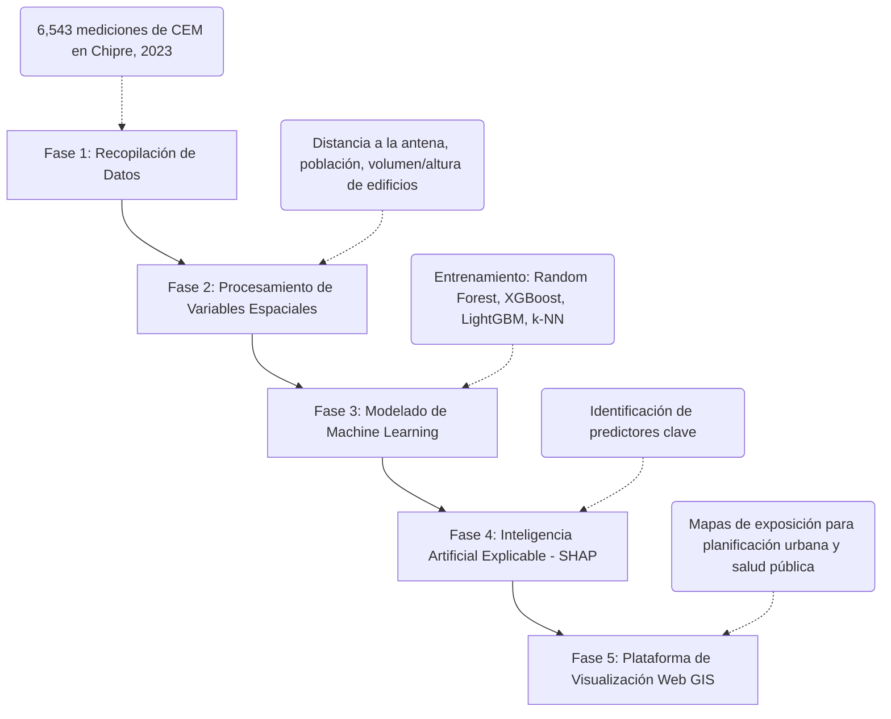

```mermaid
graph TD
    A[Fase 1: Recopilación de Datos] --> B[Fase 2: Procesamiento de Variables Espaciales]
    B --> C[Fase 3: Modelado de Machine Learning]
    C --> D[Fase 4: Inteligencia Artificial Explicable - SHAP]
    D --> E[Fase 5: Plataforma de Visualización Web GIS]

    A1(6,543 mediciones de CEM en Chipre, 2023) -.-> A
    B1(Distancia a la antena, población, volumen/altura de edificios) -.-> B
    C1(Entrenamiento: Random Forest, XGBoost, LightGBM, k-NN) -.-> C
    D1(Identificación de predictores clave) -.-> D
    E1(Mapas de exposición para planificación urbana y salud pública) -.-> E
```